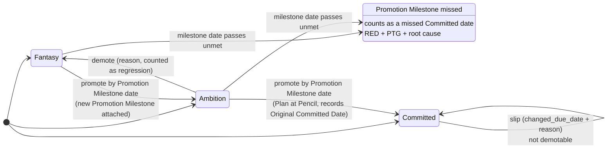
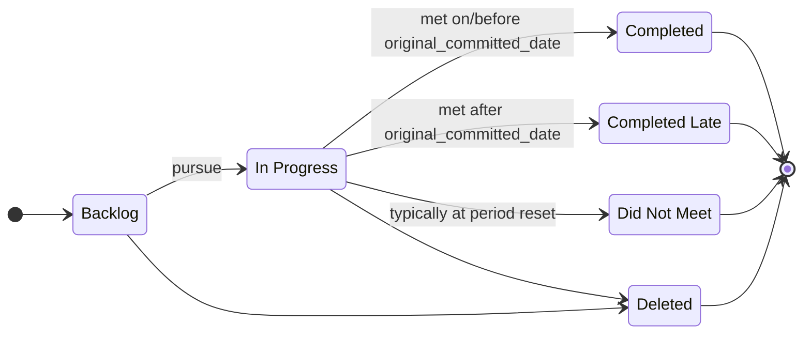

# GOALIE Specification

**Status:** Draft 0.1
**Scope:** Implementation-neutral and organization-neutral. It describes what GOALIE *is* (the concepts, data model, rules, lifecycles, views, reviews, and the User's Manual) so that it can be built as a product, or set up in an existing tool, without depending on either.

---

## 1. What GOALIE is

GOALIE is a **mechanism** for setting, relating, and inspecting goals across an organization. It isn't just an app. It has two parts:

1. **A store** that holds goals, links them to each other, to the org, to their plans, and to their work product, and makes them visible.
2. **A set of recurring reviews** that make inspecting those goals routine.

A mechanism is a complete process: **owned** by one person, built around a **tool or ritual**, **broadly adopted**, run on a **cadence**, and continually **inspected and improved**. It exists to make the right behavior the default. A GOALIE deployment is designed to meet all five:

| Part | In GOALIE |
|---|---|
| **Ownership** | One named human owns the GOALIE deployment: its configuration, reviews, and User's Manual. Not a committee. |
| **Tool or ritual** | The goal store and its views, the reviews with a fixed format, and the **User's Manual** (§11). |
| **Broad adoption** | Goals at the organization's configured levels live in GOALIE. That's how the organization runs, not an option for the good teams. |
| **Cadence** | Daily/weekly/quarterly/annual reviews (§9). |
| **Inspection & improvement** | The GOALIE owner inspects GOALIE's own fitness functions (§8.3) each quarter and changes the configuration, reviews, or manual. |

**Design intent: make the right behavior the default.** Where a rule can be enforced by the system or by an agent, it is enforced, not left to people remembering. A rule that depends on memory, motivation, or heroics is either a candidate for automation, or it stays a norm that is inspected in reviews.

**Failure modes to design against:**
- **Drift:** the cadence continues but inspection stops.
- **Owner dilution.**
- **Overcomplexity:** GOALIE should feel boring and powerful, not clever.
- **Cargo-culting:** copying artifacts without understanding why they exist, including copying a previous GOALIE deployment.

### 1.1 Humans and agents

GOALIE is designed for organizations where **AI agents work alongside humans**. Both are first-class participants and work to the same rules. The split:
- **Humans** set direction, own outcomes, make commitments, and hold the bar in reviews.
- **Agents** do much of the work behind goals, keep records accurate, enforce rules, draft status and plans, and prepare reviews.

GOALIE also works for organizations with no agents. In that case the rules that §10 assigns to agents are carried out by the tool's own automation or by people.

---

## 2. Reading this spec

Each rule belongs to one of three tiers, and the wording says which:

- **Invariant:** a hard rule that the implementation (or an agent acting through the API) enforces. There are deliberately few. They are the ones where giving way would break the mechanism.
- **Default:** how things are set up out of the box. A deployment, or an owner within their own scope, can change a default. The change is visible.
- **Norm:** how people are expected to behave, especially in reviews. It is held in place by inspection, not by software. Agents can **lint** for norms, but lints don't block anyone.

Items marked **(configurable)** are expected to differ between organizations. See §12.

---

## 3. Principles

1. **Every goal has exactly one owner, and that owner is a human** (invariant). Agents can do the work and maintain the record. They don't own goals. Groups don't own goals.
2. **Every goal has a date, and every date says what kind it is** (invariant): Committed, Ambition, or Fantasy (§5). *A plan without dates is fantasy.* A date for a date is acceptable. No date is not.
3. **Goals have criteria**, meaning an objective test of whether the goal was met (norm).
4. **Each org unit has a named human owner** (invariant for org-unit records).
5. **Goals are FAST, not SMART:**
   - **Frequently discussed:** built into reviews, used to allocate resources, set priorities, and give feedback.
   - **Ambitious:** hard but not impossible. This prevents sandbagging.
   - **Specific:** turned into concrete metrics or milestones.
   - **Transparent:** visible organization-wide by default. Restricting a goal's visibility is an explicit exception that is logged.
6. **Mostly focus on input metrics; monitor output metrics.**
   - *Input* metrics are directly controllable, e.g. features shipped, latency.
   - *Output* metrics measure results, e.g. engagement, growth.
7. **Metric-based goals are better than date-based goals.** "Launch X by D" is allowed. "Increase Foo from X to Y (+Z%) by D" is better.
8. **Committed dates are sacred.**
   - The standard to aim for is *no date is ever missed*. This is a cultural ideal, not a claim that misses never happen.
   - The Original Committed Date is not rewritten (invariant). Changes are logged, dated, and explained.
   - A missed committed date triggers root-cause analysis, not blame.
9. **Changes of state or date carry a written reason** (invariant). The history is the organization's memory.
10. **Status reflects reality; no surprises.**
    - If a goal will be RED next week, it is YELLOW this week.
    - A goal that goes GREEN → RED in one update is *status theater*, and it is the most important diagnostic event of the quarter.
11. **Multi-step goals should have intermediate milestones**, each with its own owner and date (norm).
12. **Goals are scoped to a plan period** (default: the year). At the period reset, each goal is closed out. Continuing work is re-created as a new goal marked Carryover or Repeating, not carried forward silently.

---

## 4. Concepts and lexicon

The User's Manual (§11) repeats these definitions, so terms mean the same thing everywhere in the organization.

| Term | Definition |
|---|---|
| **Org unit** | A node in the organization tree (e.g. Company → Program/Function → Team → Individual). Each has one human owner. **(configurable** names and depth) |
| **Program** | A long-term effort to deliver customer value in a well-defined area. Lasts years. Led by a single-threaded leader. |
| **Project** | A short-term effort to deliver something specific by a date. |
| **Product** | What customers experience as a whole. Programs produce Products, via Projects. |
| **Goal** | Something an org unit sets out to do, with an owner, a date, and criteria. |
| **Date Type** | How firm a goal's date is: Committed, Ambition, or Fantasy (§5). |
| **Promotion Milestone** | A goal with a committed date, by which another goal's uncommitted date moves up one Date Type (§5). |
| **Plan** | The document describing how a goal will be achieved. Its maturity is Watercolor, Crayon, or Pencil. |
| **Plan Maturity** | **Watercolor:** broad strokes, soft edges. **Crayon:** main parts clear, lines thick, details flexible. **Pencil:** precise and ready to execute; two readers would picture the same thing. |
| **Work Product** | Where the output of the work lives (repo, PR, doc folder, deployed URL, metric dashboard). |
| **Health** | GREEN / YELLOW / RED (§6.1). |
| **Path to Green (PTG)** | The written recovery plan for a YELLOW or RED goal (§6.1). |
| **Actor** | A human or an agent that reads or changes GOALIE data. Every change is attributed to an actor. |

---

## 5. Date types and the promotion rule

Not every date is the same kind of date, and treating them as the same is a major cause of dysfunction. **Every goal's date carries its type** (invariant). Planning is largely the work of moving dates **Fantasy → Ambition → Committed**.

| Date Type | Meaning | Others may… | The goal's plan contains… |
|---|---|---|---|
| **Committed** | A promise. The team has looked at the work and its capacity and said "yes, by this date." | plan around it. | A **Pencil**-stage Plan. |
| **Ambition** | A stretch. Achievable with a tailwind, but the team isn't ready to commit. Useful for energy; dangerous if quietly treated as a commitment. | not treat it as a promise. | **A milestone with a committed date by which this date will become a Committed date.** |
| **Fantasy** | What someone wishes were true, often imposed top-down. Fine as a starting point; toxic if confused with the other two. | not treat it as a promise. | **A milestone with a committed date by which this date will become an Ambition date.** |

**How the promotion rule works:**
- A goal whose Date Type is Ambition or Fantasy **has a Promotion Milestone** (invariant).
- The Promotion Milestone is itself a goal, of Type `Milestone (Commit)`, with a **Committed** date. So every uncommitted date is backed by a committed date for a date. Uncertainty is allowed; open-ended uncertainty is not. The rule ends there, because the milestone's own date is already Committed.
- On or before the milestone's date, one of two things happens:
  - The owner **promotes** the parent goal's Date Type one step and completes the milestone.
  - Or the milestone is **missed**. That is a missed committed date: RED, a PTG, and a root-cause look.
- **Promoting Fantasy → Ambition** comes with a new Promotion Milestone for Ambition → Committed.
- **Promoting Ambition → Committed** needs a Plan at Pencil maturity, records the **Original Committed Date** (§6), and removes the Promotion Milestone link. The completed milestone stays in the history.
- The promoted date can differ from the old ambition or fantasy date. Negotiating the date is part of promotion. The difference is recorded and reported (§8.2).
- **A Committed date can't be demoted** (invariant). If it can't be hit, that is a slip (§6).
- **Ambition → Fantasy** is allowed, with a reason, and is counted as a regression.

---

## 6. Data model

The model has seven entities. Field names are illustrative; implementations can rename them, as long as the User's Manual maps them to these terms.

### 6.1 Goal

| Field | Type | Required | Rules / meaning |
|---|---|---|---|
| `id` | Stable, human-readable key (e.g. `GOAL-123`) | auto | Never reused. Linkable by people, agents, and other systems. |
| `summary` | Short text | yes | Pithy and self-describing, with a verb (Increase, Launch, Reduce…). Lint: 5 words or more, or no verb. |
| `description` | Long text (Markdown) | yes | Should cover: (a) key results; (b) the metrics used to track it and how often they are reviewed; (c) why it matters and what it contributes to (e.g. a theme in the operating plan); (d) who shares responsibility for delivering it (joint owners, not dependencies). Notes are added over time. Lint: any of (a)–(d) missing. |
| `owner` | Actor (human) | yes | Exactly one human (invariant). |
| `org_unit` | → Org Unit | yes | The unit the goal belongs to. |
| `level` | Enum **(configurable)** | yes | Default: `Company` · `Program or Function` · `Team` · `Individual`. Agrees with the org unit's level. |
| `type` | Enum **(configurable)** | yes | Default: `Milestone (Commit)`, a planning goal (reaching a committed state, a signed-off plan, a date for a date; every Promotion Milestone has this type) · `Milestone (Launch)`, a launch or delivery · `Metric (Business)` · `Metric (Customer)` · `Metric (Operational Excellence)`. Types let reviewers check whether a unit has the right mix of goals. |
| `due_date` | Date | yes | The date the goal will be met. If the exact day is unknown, use the end of the relevant period, e.g. the end of the fiscal quarter **(configurable calendar)**. What the date means depends on `date_type`. |
| `date_type` | `Committed` · `Ambition` · `Fantasy` | yes | See §5 (invariant). |
| `promotion_milestone` | → Goal | if `date_type` ≠ Committed | The linked goal has `type = Milestone (Commit)`, `date_type = Committed`, a due date before this goal's, and a human owner (invariant). Empty when Committed. |
| `plan` | → Doc (hosted Markdown) or external link | when Committed; recommended before | The plan behind the goal, in whatever form it takes: a hosted Markdown plan, a 5Ps doc, a PR/FAQ, a Working Backwards doc, etc. Hosted plans are versioned, so the plan can be viewed as it stood at commit time. |
| `plan_maturity` | `Watercolor` · `Crayon` · `Pencil` | yes | Committed needs Pencil (invariant). If a team asks for a committed date on a Crayon plan, push back on the plan, not the date. |
| `work_product` | List of typed links | optional | Repo / PR / milestone, doc folder, deployed URL, metric dashboard or query. Agents follow these to gather evidence for health. Lint: missing on an in-progress `Milestone (Launch)`. |
| `original_committed_date` | Date, set by the system | auto | Recorded when `date_type` first becomes Committed. Not editable afterwards (invariant). A deployment can let the GOALIE owner, and no one else, correct a genuine data-entry error, with a logged reason. |
| `changed_due_date` | Date | optional; only when Committed | The current expected date after a slip. Each change has a reason (invariant) and is logged. No silent re-baselines. |
| `priority` | Enum **(configurable)** | yes | Default `P0` Critical · `P1` Important · `P2` Nice to have. Relative within a level or org unit. |
| `state` | Enum (§7.2) | yes | `Backlog` · `In Progress` · `Completed` · `Completed Late` · `Did Not Meet` · `Deleted`. Each change has a reason (invariant). |
| `health` | `GREEN` · `YELLOW` · `RED` | while In Progress | **GREEN:** on track; risks understood and mitigated; the owner believes the date will be hit. **YELLOW:** real unknowns or blockers, but there's still a credible path to the date. This is the status that demands action while there is time. **RED:** the date isn't credible without intervention, or there's no path to green. Health is judged against the committed date. For an uncommitted goal, that means its Promotion Milestone's date. |
| `path_to_green` | Structured: steps + criteria + trigger | when YELLOW or RED (invariant) | A good PTG has: (1) steps, each with a **named human owner** and (2) a **date** (a date for a date is OK); (3) **criteria for returning to GREEN** that can be tested without debate; (4) for YELLOW, the **trigger that turns it RED**, and what happens then. Lint: any part missing. Archived into history on return to GREEN. |
| `origination` | `New` · `Carryover` · `Repeating` | yes | New this period; carried over with a revised date; repeated with new targets. |
| `parent` | → Goal | optional | The goal this one contributes to (e.g. Team → Program → Company). |
| `visibility` | Enum | default: organization-wide | Restricting it is a logged exception. |

### 6.2 Org Unit

`id`, `name`, `level`, `parent` (→ Org Unit), `owner` (human, invariant). The org tree is stored as data, not as a text field on each goal.

### 6.3 Actor

`id`, `kind` (`human` | `agent`), `display_name`. For agents, also `operator`, the human responsible for that agent. Only humans can own goals or org units.

### 6.4 Doc

Hosted Markdown documents: **Plans** and the **User's Manual** (§11). Fields: `id`, `kind`, `title`, `body` (Markdown), version history, links to the goals that use it. External docs are linked by URL rather than hosted.

### 6.5 Event (history)

An append-only log with one entry per change: `timestamp`, `actor`, `goal`/`entity`, `field`, `old`, `new`, `reason`. It also records comments. Rollups (§8.2) are computed from it.

### 6.6 Work Item (optional extension)

A lighter record for the work under a goal: `id`, `title`, `owner` (an actor, and it can be an agent), `status`, `due_date`, links. It is linked to a goal. This extension doesn't copy the goal schema. Agents can use the state of linked work items as evidence for a goal's health.

### 6.7 Example record

```yaml
id: GOAL-42
summary: Launch self-serve onboarding
owner: jane@example.com
org_unit: program/growth
level: Program or Function
type: Milestone (Launch)
due_date: 2027-03-31
date_type: Ambition
promotion_milestone: GOAL-57      # "Commit self-serve launch date", Committed, due 2026-11-15
plan: docs/plans/self-serve-onboarding.md
plan_maturity: Crayon
work_product:
  - repo: github.com/example/onboarding
state: In Progress
health: GREEN                      # judged against GOAL-57's committed date
priority: P1
origination: New
parent: GOAL-7                     # Company: Double activated accounts
```

---

## 7. Lifecycles

A goal has two lifecycles that run in parallel:
- **State** answers "are we pursuing this goal?"
- **Date Type** answers "how firm is the date?"

Committing to *pursue* a goal is a separate decision from committing to its *date*.

### 7.1 Date lifecycle



Invariant: **at any moment, a goal whose date is not Committed has a Promotion Milestone with a Committed date.**

### 7.2 State lifecycle



| State | Date Types | Notes |
|---|---|---|
| Backlog | any (usually Fantasy or Ambition) | Being considered. The promotion rule applies here too. |
| In Progress | any | Being pursued. Health and PTG are kept current. |
| Completed / Completed Late | Committed | Lateness is measured against the **original** committed date. Changing the date doesn't remove the lateness. |
| Did Not Meet | any | Recorded honestly. |
| Deleted | any | Abandoned, with a reason. |

**Closing rule (default):** a goal reaches Completed / Completed Late once its date is Committed. If the work finishes while the date is still Ambition, the owner promotes and completes the goal in one step, with a reason. Rollups count this as *completed without a prior commitment*.

### 7.3 Period reset

At the end of the plan period (default: yearly), each open goal is closed out as Completed / Completed Late / Did Not Meet / Deleted. Continuing work becomes a new goal marked `Carryover` or `Repeating`. It starts at whatever Date Type is honest.

---

## 8. Enforcement, views, and rollups

### 8.1 Automatic enforcement

Where the implementation can do these natively it does. Otherwise an agent does them through the API.

- **Validation:** reject a save, or open a draft fix for the owner, when it would break an invariant (a missing date type, an uncommitted date with no Promotion Milestone, Committed without a Pencil plan, a date or state change without a reason, YELLOW/RED without a PTG).
- **Time-based triggers:** when a committed date, including a Promotion Milestone's, passes without being met, that goal turns RED. When a Promotion Milestone turns RED, its parent goal turns RED too.
- **Status-theater flag:** a GREEN → RED change in one step is flagged for the next review.
- **Invalid records stay visible.** A goal that breaks an invariant is flagged in a hygiene view, not hidden. Hiding it would take it out of inspection.
- **Lints:** the norms in §3 and §6.1 are flagged, not blocked.

### 8.2 Views

A view is a saved slice of goals by level, org unit, owner, type, priority, date type, health, and period.

- **Default columns:** Summary, State, Health, due date (changed if set, otherwise original), **Date Type**, Promotion Milestone and its date (if not Committed), Owner, PTG. Plan and Work Product are one click away.
- **Default sort:** RED, YELLOW, GREEN.
- **Default date presentation:** the Date Type is shown next to the date, so an uncommitted date doesn't read as a promise. Custom views can drop the column.
- **Standard views:** organization overview; one per org unit; *My goals*; *Promotions due* (Promotion Milestones due soon, default 2 weeks); *Hygiene*; period-end scorecard.

### 8.3 Rollups and fitness functions

These are derived from the event log, not entered by hand:
- Share completed on time / completed late / did not meet, by org unit and over time, measured against the original committed date.
- Committed-date slips: how often, and how large (changed − original).
- Date-type mix, time spent in each date type, how often promotion milestones are met, and the Ambition → Committed delta.
- Regressions (Ambition → Fantasy), and goals completed without a prior commitment.
- Status theater: GREEN → RED with little or no time in YELLOW.
- Goal-type mix per unit (metric vs milestone; input vs output).
- Hygiene: stale health, missing parts, expired Promotion Milestones, missing reasons.

These are also **GOALIE's own fitness functions**: the GOALIE owner inspects them to tell whether the mechanism is getting better on its own.

---

## 9. Reviews

GOALIE runs inside the organization's review cadence **(configurable)**. Typical set:

| Level | Reviews | Cadence |
|---|---|---|
| Organization | Business, Product, and People reviews | Quarterly |
| Programs / product groups | Programs review (rotating), launch readiness | Bi-weekly / weekly |
| Teams | Standup | Daily |

**Default review format.** A review owner can adapt it and records the changes in that review's page of the User's Manual.

- The review owner opens the relevant view. Discussion goes to RED and YELLOW goals and their PTGs. GREEN goals are skipped unless someone raises one.
- Participants are the owners of the goals under discussion.
- The view is read line by line: owner, date, date type, health, PTG (norm).
- Habitual questions: **"By when?"**, **"Committed, ambition, or fantasy?"**, **"Watercolor, crayon, or pencil?"**
- Promotion Milestones due since the last review are checked. Each was either promoted or missed.
- The review holds people accountable for surprises and poor hygiene. The first missed date of a period is the cheap one: analyze it rigorously, without punishing anyone.
- Action items leave with an owner and a date, or a date for a date (norm).
- A review that repeatedly changes nothing is a signal to fix the review.

---

## 10. Responsibilities: humans and agents

| Activity | Humans | Agents |
|---|---|---|
| Set goals, targets, priority | Own and decide | Draft proposals; check them against FAST and the schema |
| Own a goal | Yes | No |
| Do the work behind a goal | Yes | Yes |
| Health / PTG | Approve | Draft from evidence (work product, linked work items, metrics); flag drift |
| Set / promote Date Type | Decide. A commitment is a human promise. | Create a draft Promotion Milestone when a goal gets an uncommitted date; remind owners when promotions are due; check Plan Maturity before a promotion |
| Enforce rules | Hold the bar in reviews | Validate, run time-based triggers, flag status theater |
| Hygiene | Hold the bar in reviews | Detect, nag, and fix automatically where safe |
| Review prep | Read, decide | Build the RED/YELLOW pre-read and the slip analysis |
| Change the mechanism | GOALIE owner decides | Propose changes from what inspection shows; draft updates to the User's Manual |

---

## 11. The User's Manual (required)

A GOALIE deployment includes its **User's Manual**. A deployment without one isn't finished. It is the mechanism's written memory. It is short and living, and it is written for participants as the mechanism's customers.

**Contents**

| Section | What it covers |
|---|---|
| Purpose | Why GOALIE exists here and what behavior it makes the default. |
| Owner | The named GOALIE owner, and how to reach them. |
| Lexicon | The §4 terms, plus any local renames or configuration (§12). |
| Participants & their jobs | Goal owners, org-unit owners, review owners, agents. |
| Procedures | Create a goal; set and promote a date type; commit a date; report YELLOW/RED and write a PTG; record a slip; close a goal; do the period reset. |
| Rules | The invariants, defaults, and norms in effect, including what is enforced automatically. |
| Cadence & reviews | The review calendar, plus a one-page manual per review (owner, participants, view, agenda, outputs, local adaptations). |
| Outputs | Dashboards, pre-reads, the period-end scorecard. |
| Inspection & health metrics | The fitness functions in use, their targets, and how they are inspected. |
| Examples | A good goal, a good PTG, and a correctly backed ambition date, each next to a weak example. |
| Changelog | Dated changes to configuration, rules, or reviews, each with its reason. |

**Properties**
- **Hosted in GOALIE** as a versioned Markdown Doc, linked from the default views and from the goal-creation flow.
- **Short.** The core aims for a page or two, with procedures and examples as appendices. If explaining a part of GOALIE takes a lot of words, treat that as a signal to simplify that part.
- **Serves humans and agents alike.** The manual is the source for the instructions agents run under, so there is no separate agent rulebook that can drift out of step.
- **Owned and inspected.** The GOALIE owner keeps it current and reviews it with each quarterly inspection. A change to configuration or reviews is finished once the manual reflects it.
- **The onboarding path** for new owners, human or agent.

An implementation ships a **User's Manual template** that follows this structure.

---

## 12. Configuration points

These are expected to vary between organizations. The User's Manual records the choices a deployment makes.

| Setting | Default |
|---|---|
| Level names and depth of the org tree | Company / Program or Function / Team / Individual |
| Goal types | The five types in §6.1 |
| Priority scale | P0–P2 |
| Fiscal calendar (period ends, default dates) | Calendar quarters, yearly plan period |
| Review set and cadence | §9 |
| "Promotions due" window | 2 weeks |
| Visibility policy | Organization-wide; logged exceptions |
| Who can correct an Original Committed Date | GOALIE owner only, with reason (or no one) |
| Lints enabled | All in §6.1 |

The invariants in §2 aren't configuration. A deployment that turns them off isn't running GOALIE.

---

## 13. Requirements for an implementation

Whether GOALIE is built as a product or set up in an existing tool, the implementation provides the following. Each can be met natively, or by an agent working through the API.

1. **Data model:** the entities in §6, with typed links: goal → promotion milestone, goal → parent, goal → plan, goal → work product, goal → work items, goal → org unit.
2. **Validation:** fields that are required only in some cases, and checks across records (§8.1).
3. **Time-based triggers** (§8.1).
4. **Fields set by the system that can't be edited** (`original_committed_date`), or an audit trail good enough to detect and undo an edit.
5. **Doc hosting:** versioned Markdown for plans and the User's Manual, plus links to external docs.
6. **Event log:** field-level history attributed to an actor, human or agent.
7. **Views:** saved, shareable, filterable, custom sort, showing fields from linked records.
8. **API complete enough for agents:** anything a human can read or write, an agent can, ideally exposed as an MCP server.
9. **Events / webhooks,** so agents can react to changes.
10. **Actor identity** that tells humans and agents apart.
11. **Full export** of goals, docs, and the event log. The organization owns its memory.
12. **Configuration** per §12.

Optional: the work-item extension (§6.6); computed rollups built in (otherwise agents compute and publish them); integrations with code hosts and document suites.

---

## 14. Sources

GOALIE has been built and run at several companies. This spec formalizes it independently of any particular tool. Background reading (tig.log):
- *Mechanisms* (2020): https://blog.kindel.com/2020/03/06/mechanisms/
- *Make the Routine, Routine – Blow up Dunbar's Number* (2023): https://blog.kindel.com/2023/04/02/make-the-routine-routine-blow-up-dunbars-number/
- *Path To Green* (2020): https://blog.kindel.com/2020/02/16/path-to-green/
- *Have a Plan (With Dates)* (2019): https://blog.kindel.com/2019/04/18/have-a-plan-with-dates/
- *The 5Ps: Achieving Focus in Any Endeavor* (2011): https://blog.kindel.com/2011/06/14/the-5-ps-achieving-focus-in-any-endeavor/
- *Taxonomy and Lexicon* (2019): https://blog.kindel.com/2019/07/03/taxonomy-and-lexicon/
- *Leading by Fitness Functions* (2025): https://blog.kindel.com/2025/11/01/leading-by-fitness-function/
