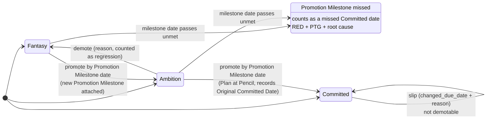
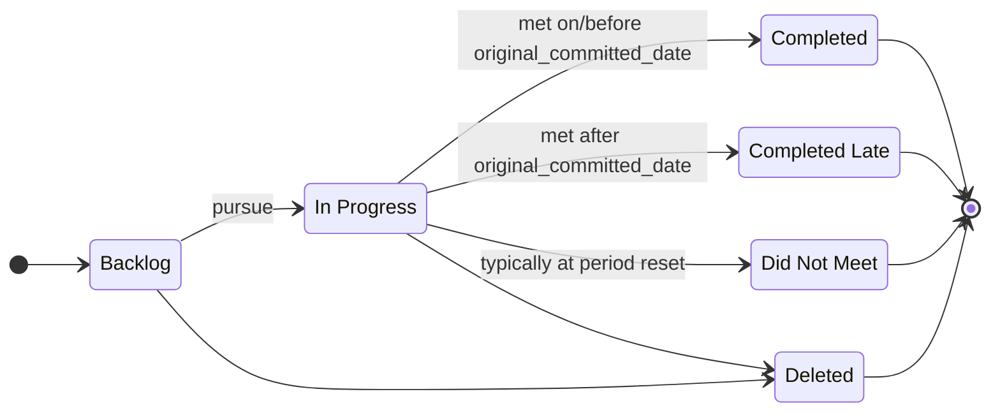

# GOALIE Specification

**Status:** Draft 0.2
**Scope:** Implementation-neutral and organization-neutral. It describes what GOALIE *is* (the concepts, data model, rules, lifecycles, views, reviews, and the User's Manual) so that it can be built as a product, or set up in an existing tool, without depending on either.

## 1. What GOALIE is

GOALIE is a **mechanism** for setting, relating, and inspecting goals across an organization. It isn't just an app. It has three parts:

1. **A store** that holds goals, links them to each other, to the org, to their plans, and to their work product, and makes them visible.
2. **An app** that enables humans to view, edit, comment, and collaborate on goals. The app is available on the web and on mobile devices.
3. **A system of recurring reviews** that make inspecting those goals routine. The reviews are driven by humans using dashboards presented by the app.

A mechanism is a complete process: **owned** by one person, built around a **tool or ritual**, **broadly adopted**, run on a **cadence**, and continually **inspected and improved**. It exists to make the right behavior the default. A GOALIE deployment is designed to meet all five:

| Part | In GOALIE |
|---|---|
| **Ownership** | One named human owns the GOALIE deployment: its configuration, reviews, and User's Manual. Not a committee. |
| **Tool or ritual** | The goal store and its views, the reviews with a fixed format, and the **User's Manual** ([§11 (User's Manual)](#s11)). |
| **Broad adoption** | Goals at the organization's configured levels live in GOALIE. That's how the organization runs, not an option for the good teams. |
| **Cadence** | Daily/weekly/quarterly/annual reviews ([§9 (Reviews)](#s9)). |
| **Inspection & improvement** | The GOALIE owner inspects GOALIE's own fitness functions ([§8.3 (Rollups)](#s8-3)) each quarter and changes the configuration, reviews, or manual. |

**Design intent: make the right behavior the default.** Where a rule can be enforced by the system or by an agent, it is enforced, not left to people remembering. A rule that depends on memory, motivation, or heroics is either a candidate for automation, or it stays a norm that is inspected in reviews.

**Failure modes to design against:**
- **Drift:** the cadence continues but inspection stops.
- **Owner dilution.**
- **Overcomplexity:** GOALIE should feel boring and powerful, not clever.
- **Cargo-culting:** copying artifacts without understanding why they exist, including copying a previous GOALIE deployment.

### 1.1 Humans and agents

GOALIE is designed for organizations where **AI agents work alongside humans**. Both are first-class participants and work to the same rules. The split:

- **Humans** set direction, own outcomes, make commitments, and hold the bar in reviews. 
- **Agents** do much of the work behind goals, keep records accurate, enforce rules, draft status and plans, and prepare reviews. 

GOALIE also works for organizations with no agents. In that case the rules that [§10 (Humans and agents)](#s10) assigns to agents are carried out by the tool's own automation or by people.

### 1.2 How a human spends time

The GOALIE app is where a human works the goals they own and the goals related to their work. Related goals include goals they delegated and goals they share with others. There they create, review, update, and comment on those goals.

When a set of goals needs inspection, the app presents dashboards and other summaries of that set. 

Between reviews, a human opens a view, opens a goal, and keeps it true. *My goals* and the view for each org unit are where that work starts ([§8.2 (Views)](#s8-2)). The same humans share those views, the goals, the Docs, and the work items.

A human must be able to do the following with no agent present (invariant):

- Open *My goals* or an org unit's view, then open a goal and read its fields.
- Edit those fields. Structured fields follow [§6 (Data model)](#s6). The description and the linked plan follow [§6.5 (Doc)](#s6-5).
- Write the linked plan. That plan is a Doc, and the Doc is a page the human writes ([§6.5 (Doc)](#s6-5)).
- Comment on a goal, or on any other entity. A comment is prose recorded as an Event ([§6.6 (Events)](#s6-6)). In the first version a comment does not reply to another comment.
- File a work item under the goal when that extension is on ([§6.7 (Work item)](#s6-7)).

Two humans (or agents) must be able to have the same goal open and change it during the same period (invariant). They share the goal's fields, its comments, its linked plan, and its work items when that extension is on. Each sees the other's committed change within the live-update time, and sees the other's Presence ([§8.2 (Views)](#s8-2)). A conflict on a structured field is prevented: the stale write is rejected and the current state is returned ([§6 (Data model)](#s6)). An edit to Markdown text must not be lost ([§6.5 (Doc)](#s6-5)). Work a person did must not disappear without an Event.

## 2. Reading this spec
<a id="s2"></a>

Each rule belongs to one of three tiers, and the wording says which:

- **Invariant:** a hard rule that the implementation (or an agent acting through the API) enforces. There are deliberately few. They are the ones where giving way would break the mechanism.
- **Default:** how things are set up out of the box. A deployment, or an owner within their own scope, can change a default. The change is visible.
- **Norm:** how people are expected to behave, especially in reviews. It is held in place by inspection, not by software. Agents can **lint** for norms, but lints don't block anyone.

Items marked **(configurable)** are expected to differ between organizations. See [§12 (Configuration)](#s12).

## 3. Principles
<a id="s3"></a>

1. **Every goal has exactly one owner, and that owner is a human** (invariant). Agents can do the work and maintain the record. They don't own goals. Groups don't own goals.
2. **Every goal has a date, and every date says what kind it is** (invariant): Committed, Ambition, or Fantasy ([§5 (Date types)](#s5)). *A plan without dates is fantasy.* A date for a date is acceptable. No date is not.
3. **Goals have criteria**, meaning an objective test of whether the goal was met (norm).
4. **Each org unit has a named human owner** (invariant for org-unit records).
5. **Goals are FAST, not SMART:**
   - **Frequently discussed:** built into reviews, used to allocate resources, set priorities, and give feedback.
   - **Ambitious:** hard but not impossible. This prevents sandbagging.
   - **Specific:** turned into concrete metrics or milestones.
   - **Transparent:** visible organization-wide by default. Restricting a goal's visibility is an explicit exception that is logged.
6. **Mostly focus on input metrics; monitor output metrics.**
   - *Input* metrics are directly controllable, e.g. features shipped, latency.
   - *Output* metrics measure results, e.g. engagement, growth.
7. **Metric-based goals are better than date-based goals.** "Launch X by D" is allowed. "Increase Foo from X to Y (+Z%) by D" is better.
8. **Committed dates are sacred.**
   - The standard to aim for is *no date is ever missed*. This is a cultural ideal, not a claim that misses never happen.
   - The Original Committed Date is not rewritten (invariant). Changes are logged, dated, and explained.
   - A missed committed date triggers root-cause analysis, not blame.
9. <a id="s3-9"></a> **Changes of state or date carry a written reason** (invariant). The history is the organization's memory.
10. **Status reflects reality; no surprises.**
    - If a goal will be RED next week, it is YELLOW this week.
    - A goal that goes GREEN → RED in one update is *status theater*, and it is the most important diagnostic event of the quarter.
11. **Multi-step goals should have intermediate milestones**, each with its own owner and date (norm).
12. **Goals are scoped to a plan period** (default: the year). At the period reset, each goal is closed out. Continuing work is re-created as a new goal marked Carryover or Repeating, not carried forward silently.
13. **Severity is not priority.**
    - *Severity* says how much a goal matters on its own terms: critical, important, or nice to have.
    - *Prioritization* means deciding to focus energy and resources on the few things at the top of a ranked list, and to **starve** the things lower down.
    - **Starvation is the point.** Putting more resources into higher priorities means, by definition, that lower ones get less. A priority list that starves nothing hasn't made a decision.
    - GOALIE keeps the two apart: `severity` is a field on each goal, and **Priorities** are a separate ranked list per org unit that goals map to ([§6.3 (Priority)](#s6-3)).

## 4. Concepts and lexicon
<a id="s4"></a>

The User's Manual ([§11 (User's Manual)](#s11)) repeats these definitions, so terms mean the same thing everywhere in the organization.

| Term | Definition |
|---|---|
| **Org unit** | A node in the organization tree (e.g. Company → Program/Function → Team → Individual). Each has one human owner. **(configurable** names and depth) |
| **Program** | A long-term effort to deliver customer value in a well-defined area. Lasts years. Led by a single-threaded leader. |
| **Project** | A short-term effort to deliver something specific by a date. |
| **Product** | What customers experience as a whole. Programs produce Products, via Projects. |
| **Goal** | Something an org unit sets out to do, with an owner, a date, and criteria. |
| **Severity** | How critical a goal is on its own terms: `sev1` critical / urgent / blocking · `sev2` important · `sev3` nice to have. It isn't a ranking. |
| **Priority** | An entry in an org unit's **ranked** list of current priorities for the period, e.g. the Priorities of its 5Ps or operating plan. Rank decides where energy and resources go. |
| **Starvation** | The deliberate lack of attention and resources for items lower on the priority list. It is the intended effect of prioritizing, not a failure. |
| **Date Type** | How firm a goal's date is: Committed, Ambition, or Fantasy ([§5 (Date types)](#s5)). |
| **Promotion Milestone** | A goal with a committed date, by which another goal's uncommitted date moves up one Date Type ([§5 (Date types)](#s5)). |
| **Plan** | The document describing how a goal will be achieved. Its maturity is Watercolor, Crayon, or Pencil. |
| **Doc** | A page a human opens and writes: a plan or the User's Manual ([§6.5 (Doc)](#s6-5), [§11 (User's Manual)](#s11)). It is not only a stored body. |
| **Plan Maturity** | **Watercolor:** broad strokes, soft edges. **Crayon:** main parts clear, lines thick, details flexible. **Pencil:** precise and ready to execute; two readers would picture the same thing. |
| **Work Product** | Where the output of the work lives (repo, PR, doc folder, deployed URL, metric dashboard). |
| **Health** | GREEN / YELLOW / RED ([§6.1 (Goal)](#s6-1)). |
| **Path to Green (PTG)** | The written recovery plan for a YELLOW or RED goal ([§6.1 (Goal)](#s6-1)). |
| **Actor** | A human or an agent that reads or changes GOALIE data. Every change is attributed to an actor. |
| **Draft** | An agent's proposed change to an entity. It is visible on that entity as soon as the agent creates it. It must not take effect until a human approves it ([§6.9 (Draft)](#s6-9)). Approving or rejecting a Draft is its own Event, with an actor and a reason. |
| **Presence** | Which actors are viewing or editing an entity right now. An actor is a human or an agent. Views show Presence ([§8.2 (Views)](#s8-2)). Presence is not an Event. |
| **Comment** | Prose an actor attaches to any entity in the data model ([§6 (Data model)](#s6)). It is not its own entity. It is recorded as an Event ([§6.6 (Events)](#s6-6)). In the first version a comment does not reply to another comment. Later, a comment may name the comment it replies to. Threaded comments are not required now. |
| **Version** | The version of an entity a write read. A committed write advances the version. A write names the version it read ([§6 (Data model)](#s6)). A Doc keeps a version history ([§6.5 (Doc)](#s6-5)). |

## 5. Date types and the promotion rule
<a id="s5"></a>

Not every date is the same kind of date, and treating them as the same is a major cause of dysfunction. **Every goal's date carries its type** (invariant). Planning is largely the work of moving dates **Fantasy → Ambition → Committed**.

| Date Type | Meaning | Others may… | The goal's plan contains… |
|---|---|---|---|
| **Committed** | A promise. The team has looked at the work and its capacity and said "yes, by this date." | plan around it. | A **Pencil**-stage Plan. |
| **Ambition** | A stretch. Achievable with a tailwind, but the team isn't ready to commit. Useful for energy; dangerous if quietly treated as a commitment. | not treat it as a promise. | **A milestone with a committed date by which this date will become a Committed date.** |
| **Fantasy** | What someone wishes were true, often imposed top-down. Fine as a starting point; toxic if confused with the other two. | not treat it as a promise. | **A milestone with a committed date by which this date will become an Ambition date.** |

**How the promotion rule works:**
- A goal whose Date Type is Ambition or Fantasy **has a Promotion Milestone** (invariant).
- The Promotion Milestone is itself a goal, of Type `Milestone (Commit)`, with a **Committed** date. So every uncommitted date is backed by a committed date for a date. Uncertainty is allowed; open-ended uncertainty is not. The rule ends there, because the milestone's own date is already Committed.
- On or before the milestone's date, one of two things happens:
  - The owner **promotes** the parent goal's Date Type one step and completes the milestone.
  - Or the milestone is **missed**. That is a missed committed date: RED, a PTG, and a root-cause look.
- **Promoting Fantasy → Ambition** comes with a new Promotion Milestone for Ambition → Committed.
- **Promoting Ambition → Committed** needs a Plan at Pencil maturity, records the **Original Committed Date** ([§6 (Data model)](#s6)), pins the plan's Doc version (`committed_plan_version`, [§6.1 (Goal)](#s6-1)), and removes the Promotion Milestone link. The completed milestone stays in the history.
- The promoted date can differ from the old ambition or fantasy date. Negotiating the date is part of promotion. The difference is recorded and reported ([§8.2 (Views)](#s8-2)).
- **A Committed date can't be demoted** (invariant). If it can't be hit, that is a slip ([§6 (Data model)](#s6)).
- **Ambition → Fantasy** is allowed, with a reason, and is counted as a regression.

## 6. Data model
<a id="s6"></a>

The model has eight entities: Goal, Org Unit, Priority, Actor, Doc, Event, Draft, and an optional Work Item. Field names are illustrative; implementations can rename them, as long as the User's Manual maps them to these terms.

Every writable entity has a version (invariant). A write names the version of the entity it read (invariant). A write against a stale version is rejected, and the rejection returns the current state (invariant). A committed write advances the version.

Structured fields are state, date type, health, PTG, rank, and every other field that is not Markdown text. They change only through validated writes (invariant). Automatic merging must not apply to them (invariant). Two changes can each be valid and still break an invariant together. One actor sets the plan to Crayon while another promotes the goal to Committed, which breaks [§5 (Date types)](#s5). An automatic merge would also leave no single actor and no single reason, which breaks [§3.9 (Principle 9)](#s3-9) and [§6.6 (Events)](#s6-6).

### 6.1 Goal
<a id="s6-1"></a>

| Field | Type | Required | Rules / meaning |
|---|---|---|---|
| `id` | Stable, human-readable key (e.g. `GOAL-123`) | auto | Never reused. Linkable by people, agents, and other systems. |
| `version` | Integer | auto | The version of this goal ([§6 (Data model)](#s6)). A committed write advances it. |
| `summary` | Short text | yes | Pithy and self-describing, with a verb (Increase, Launch, Reduce…). Lint: 5 words or more, or no verb. |
| `description` | Long text (Markdown) | yes | Should cover: (a) key results; (b) the metrics used to track it and how often they are reviewed; (c) why it matters and what it contributes to (e.g. a theme in the operating plan); (d) who shares responsibility for delivering it (joint owners, not dependencies). Notes are added over time. Lint: any of (a)–(d) missing. Concurrent editing follows [§6.5 (Doc)](#s6-5). |
| `owner` | Actor (human) | yes | Exactly one human (invariant). |
| `org_unit` | → Org Unit | yes | The unit the goal belongs to. |
| `level` | Enum **(configurable)** | yes | Default: `Company` · `Program or Function` · `Team` · `Individual`. Agrees with the org unit's level. |
| `type` | Enum **(configurable)** | yes | Default: `Milestone (Commit)`, a planning goal (reaching a committed state, a signed-off plan, a date for a date; every Promotion Milestone has this type) · `Milestone (Launch)`, a launch or delivery · `Metric (Business)` · `Metric (Customer)` · `Metric (Operational Excellence)`. Types let reviewers check whether a unit has the right mix of goals. |
| `due_date` | Date | yes | The date the goal will be met. If the exact day is unknown, use the end of the relevant period, e.g. the end of the fiscal quarter **(configurable calendar)**. What the date means depends on `date_type`. |
| `date_type` | `Committed` · `Ambition` · `Fantasy` | yes | See [§5 (Date types)](#s5) (invariant). |
| `promotion_milestone` | → Goal | if `date_type` ≠ Committed | The linked goal has `type = Milestone (Commit)`, `date_type = Committed`, a due date before this goal's, and a human owner (invariant). Empty when Committed. |
| `plan` | → Doc (hosted Markdown) or external link | when Committed; recommended before | The plan behind the goal, in whatever form it takes: a hosted Markdown plan, a 5Ps doc, a PR/FAQ, a Working Backwards doc, etc. (see *Tig's Toolbox for Product Management* in [§14 (Sources)](#s14)). Hosted plans are versioned, so the plan can be viewed as it stood at commit time. The pinned version is `committed_plan_version`. |
| `committed_plan_version` | Doc version | auto, when first Committed | Set when `date_type` first becomes Committed (invariant). It is the plan's Doc version at that moment. Later edits to the Doc must not change it. |
| `plan_maturity` | `Watercolor` · `Crayon` · `Pencil` | yes | Committed needs Pencil (invariant). If a team asks for a committed date on a Crayon plan, push back on the plan, not the date. |
| `work_product` | List of typed links | optional | Repo / PR / milestone, doc folder, deployed URL, metric dashboard or query. Agents follow these to gather evidence for health. Lint: missing on an in-progress `Milestone (Launch)`. |
| `original_committed_date` | Date, set by the system | auto | Recorded when `date_type` first becomes Committed. Not editable afterwards (invariant). A deployment can let the GOALIE owner, and no one else, correct a genuine data-entry error, with a logged reason. |
| `changed_due_date` | Date | optional; only when Committed | The current expected date after a slip. Each change has a reason (invariant) and is logged. No silent re-baselines. |
| `severity` | Enum **(configurable)** | yes | Default `sev1` critical / urgent / blocking · `sev2` important · `sev3` nice to have. Says how critical the goal is, not where it ranks (see `priority`). |
| `priority` | → Priority | optional; usually only for Company, Program, or Function goals | The current priority this goal serves. It links to an entry in an org unit's ranked Priority list ([§6.3 (Priority)](#s6-3)), typically the goal's own unit or an ancestor's. Goals under a starved priority, or with no priority, are expected to get less. Reviews and rollups make that visible, so the starvation is deliberate rather than accidental. |
| `state` | Enum ([§7.2 (State lifecycle)](#s7-2)) | yes | `Backlog` · `In Progress` · `Completed` · `Completed Late` · `Did Not Meet` · `Deleted`. Each change has a reason (invariant). |
| `health` | `GREEN` · `YELLOW` · `RED` | while In Progress | **GREEN:** on track; risks understood and mitigated; the owner believes the date will be hit. **YELLOW:** real unknowns or blockers, but there's still a credible path to the date. This is the status that demands action while there is time. **RED:** the date isn't credible without intervention, or there's no path to green. Health is judged against the committed date. For an uncommitted goal, that means its Promotion Milestone's date. |
| `path_to_green` | Structured: steps + criteria + trigger | when YELLOW or RED (invariant) | A good PTG has: (1) steps, each with a **named human owner** and (2) a **date** (a date for a date is OK); (3) **criteria for returning to GREEN** that can be tested without debate; (4) for YELLOW, the **trigger that turns it RED**, and what happens then. Lint: any part missing. Archived into history on return to GREEN. |
| `origination` | `New` · `Carryover` · `Repeating` | yes | New this period; carried over with a revised date; repeated with new targets. |
| `parent` | → Goal | optional | The goal this one contributes to (e.g. Team → Program → Company). |
| `visibility` | Enum | default: organization-wide | Restricting it is a logged exception. |

### 6.2 Org Unit

`id`, `name`, `level`, `parent` (→ Org Unit), `owner` (human, invariant). The org tree is stored as data, not as a text field on each goal.

### 6.3 Priority
<a id="s6-3"></a>

An org unit's **ranked list of current priorities** for a plan period. It is usually taken from the unit's 5Ps or operating plan.

| Field | Type | Rules / meaning |
|---|---|---|
| `id` | Stable key | Linkable. |
| `org_unit` | → Org Unit | Whose list this is. Typically Company, Program, or Function. |
| `period` | Plan period | Which period the list covers. |
| `rank` | Integer | 1 is the top. **No two current entries in the same list share a rank** (invariant). A stack rank forces the decision that tied ranks avoid. |
| `title` | Short text | E.g. "Win the SMB segment." |
| `description` | Markdown | What the priority means, and what it explicitly starves. |
| `cut_line` | Boolean or rank | Optional. Marks where funded priorities end. Items below it are knowingly starved. |
| `status` | `Current` · `Retired` | Retiring an entry or changing its rank is logged with a reason, like any other change. |

The list's owner is the org unit's owner. Re-ranking is a normal, logged decision. Priorities aren't set in stone: they are reviewed on cadence (typically quarterly) and expected to stay steady between reviews.

**Keep the list short.** A long list of "priorities" is peanut butter: resources and energy spread thin across everything. Lints:
- More than 4 current entries above the cut line is flagged as a red flag **(configurable threshold)**.
- An entry with no goals mapped to it for a full review cycle is flagged. A priority that is consistently starved probably isn't one.

### 6.4 Actor

`id`, `kind` (`human` | `agent`), `display_name`. For agents, also `operator`, the human responsible for that agent. Only humans can own goals or org units.

### 6.5 Doc
<a id="s6-5"></a>

Hosted Markdown documents: **Plans** and the **User's Manual** ([§11 (User's Manual)](#s11)). Fields: `id`, `kind`, `title`, `body` (Markdown), `version`, version history, links to the goals that use it. External docs are linked by URL rather than hosted. A Doc is a page a human opens and writes, not only a stored body (invariant). A human can write that page with no agent (invariant).

More than one actor may edit a Doc body, or a goal's description, at the same time (invariant). An edit must not be lost (invariant). A saved Doc version is taken from that text (invariant). Non-text fields do not follow this rule ([§6 (Data model)](#s6)).

### 6.6 Event (history)
<a id="s6-6"></a>

An append-only log with one entry per change: `sequence`, `timestamp`, `actor`, `goal`/`entity`, `field`, `old`, `new`, `reason`. Every Event has a sequence number that only increases (invariant). The Event log is the change stream that views and agents subscribe to (invariant). Agents subscribe to the same change stream that views use. A client that reconnects resumes from the last sequence number it received (invariant). It receives every Event with a greater sequence, so it misses nothing (invariant). The log also records comments. Any entity in the model can have comments (invariant). A comment is not its own entity. It is an Event on that entity: the entity is the record, the new value is the text, the old value is empty unless that text was edited, and the reason is the text when the writer does not supply a separate one. In the first version a comment must not reply to another comment (invariant). Later, a comment may name the comment it replies to. Threaded comments must not be required now. Approving or rejecting a Draft is its own Event, with an actor and a reason (invariant). Rollups ([§8.3 (Rollups)](#s8-3)) are computed from it.

Every change to a goal, a Doc, a work item, or a priority, and every comment, is an Event (invariant). The Event records who (`actor`), when (`timestamp`), the old value, the new value, and the reason. A human reads those Events on the goal, Doc, work item, or priority they belong to (invariant). A human can follow one goal's Events across a plan period (invariant). Export of the log ([§13 (Requirements)](#s13)) is not the only way to read the history (invariant). The current fields are not a substitute for the trail (invariant). A human reads a comment on the entity it is attached to (invariant).

### 6.7 Work Item (optional extension)
<a id="s6-7"></a>

A lighter record for the work under a goal: `id`, `title`, `owner` (an actor, and it can be an agent), `status`, `due_date`, links. It is linked to a goal. This extension doesn't copy the goal schema. Agents can use the state of linked work items as evidence for a goal's health. When the extension is on, work items are the group's list of work under a goal (invariant for a deployment that enables the extension). A human can file a work item with no agent (invariant for a deployment that enables the extension). The extension stays optional ([§13 (Requirements)](#s13)).

### 6.8 Example record

```yaml
id: GOAL-42
summary: Launch self-serve onboarding
owner: jane@example.com
org_unit: program/growth
level: Program or Function
type: Milestone (Launch)
due_date: 2027-03-31
date_type: Ambition
promotion_milestone: GOAL-57      # "Commit self-serve launch date", Committed, due 2026-11-15
plan: docs/plans/self-serve-onboarding.md
plan_maturity: Crayon
work_product:
  - repo: github.com/example/onboarding
state: In Progress
health: GREEN                      # judged against GOAL-57's committed date
severity: sev2
priority: PRI-3                   # Growth program priority #3: "Cut time-to-value"
origination: New
parent: GOAL-7                     # Company: Double activated accounts
```

### 6.9 Draft
<a id="s6-9"></a>

An agent's proposed change that waits for a human. Fields: `id`, `entity`, `actor` (an agent), `base_version` (the version the agent read), `change`, `reason`. There is no status field. The Draft is waiting until an approval or rejection Event exists.

An agent's Draft must appear live on the goal. It must not take effect until a human approves it (invariant). Approving or rejecting a Draft is its own Event, with an actor and a reason (invariant). Approval is a write against `base_version` (invariant). If that version is stale, the approval is rejected and the rejection returns the current state ([§6 (Data model)](#s6)).

## 7. Lifecycles

A goal has two lifecycles that run in parallel:
- **State** answers "are we pursuing this goal?"
- **Date Type** answers "how firm is the date?"

Committing to *pursue* a goal is a separate decision from committing to its *date*.

### 7.1 Date lifecycle


```mermaid
stateDiagram-v2
    direction LR
    state "Promotion Milestone missed" as Missed
    [*] --> Fantasy
    [*] --> Ambition
    [*] --> Committed
    Fantasy --> Ambition: promote by Promotion Milestone date<br/>(new Promotion Milestone attached)
    Ambition --> Committed: promote by Promotion Milestone date<br/>(Plan at Pencil, records Original Committed Date)
    Ambition --> Fantasy: demote (reason, counted as regression)
    Committed --> Committed: slip (changed_due_date + reason)<br/>not demotable

    Fantasy --> Missed: milestone date passes unmet
    Ambition --> Missed: milestone date passes unmet
    Missed: counts as a missed Committed date<br/>RED + PTG + root cause
```

Invariant: **at any moment, a goal whose date is not Committed has a Promotion Milestone with a Committed date.**

### 7.2 State lifecycle
<a id="s7-2"></a>


```mermaid
stateDiagram-v2
    direction LR
    state "In Progress" as InProgress
    state "Completed Late" as CompletedLate
    state "Did Not Meet" as DidNotMeet
    [*] --> Backlog
    Backlog --> InProgress: pursue
    Backlog --> Deleted
    InProgress --> Completed: met on/before original_committed_date
    InProgress --> CompletedLate: met after original_committed_date
    InProgress --> DidNotMeet: typically at period reset
    InProgress --> Deleted
    Completed --> [*]
    CompletedLate --> [*]
    DidNotMeet --> [*]
    Deleted --> [*]
```

| State | Date Types | Notes |
|---|---|---|
| Backlog | any (usually Fantasy or Ambition) | Being considered. The promotion rule applies here too. |
| In Progress | any | Being pursued. Health and PTG are kept current. |
| Completed / Completed Late | Committed | Lateness is measured against the **original** committed date. Changing the date doesn't remove the lateness. |
| Did Not Meet | any | Recorded honestly. |
| Deleted | any | Abandoned, with a reason. |

**Closing rule (default):** a goal reaches Completed / Completed Late once its date is Committed. If the work finishes while the date is still Ambition, the owner promotes and completes the goal in one step, with a reason. Rollups count this as *completed without a prior commitment*.

### 7.3 Period reset

At the end of the plan period (default: yearly), each open goal is closed out as Completed / Completed Late / Did Not Meet / Deleted. Continuing work becomes a new goal marked `Carryover` or `Repeating`. It starts at whatever Date Type is honest.

## 8. Enforcement, views, and rollups

### 8.1 Automatic enforcement
<a id="s8-1"></a>

Where the implementation can do these natively it does. Otherwise an agent does them through the API.

- **Validation:** reject a save, or open a Draft for the owner, when it would break an invariant (a missing date type, an uncommitted date with no Promotion Milestone, Committed without a Pencil plan, a date or state change without a reason, YELLOW/RED without a PTG).
- **Structured fields:** state, date type, health, PTG, rank, and every other field that is not Markdown text change only through validated writes (invariant, [§6 (Data model)](#s6)). Automatic merging must not apply to them (invariant).
- **Stale writes:** a write names the version it read (invariant, [§6 (Data model)](#s6)). A write against a stale version is rejected, and the rejection returns the current state (invariant).
- **Commit check:** Invariants are checked on the committed result, on the server, in one transaction (invariant). A failed check must not become visible.
- **Time-based triggers:** when a committed date, including a Promotion Milestone's, passes without being met, that goal turns RED. When a Promotion Milestone turns RED, its parent goal turns RED too.
- **Status-theater flag:** a GREEN → RED change in one step is flagged for the next review.
- **Invalid records stay visible.** A goal that breaks an invariant is flagged in a hygiene view, not hidden. Hiding it would take it out of inspection.
- **Deleted records stay findable.** A goal whose state is Deleted remains reachable, and its Events remain readable (invariant).
- **Lints:** the norms in [§3 (Principles)](#s3) and [§6.1 (Goal)](#s6-1) are flagged, not blocked.

### 8.2 Views
<a id="s8-2"></a>

A view is a screen a human opens in the app, and a saved definition of which goals it shows, which columns it shows, and how it sorts (invariant). The saved definition selects goals by level, org unit, owner, type, severity, priority, date type, health, and period. It is not a database view. The app renders that saved definition. A database view alone must not satisfy this requirement. A screen with no saved definition must not satisfy it either.

- **Default columns:** Summary, State, Health, due date (changed if set, otherwise original), **Date Type**, Promotion Milestone and its date (if not Committed), Owner, PTG. Plan and Work Product are one click away.
- **Default sort:** RED, YELLOW, GREEN.
- **Default date presentation:** the Date Type is shown next to the date, so an uncommitted date doesn't read as a promise. Custom views can drop the column.
- **Standard views:** organization overview; one per org unit; *My goals*; *Promotions due* (Promotion Milestones due soon, default 2 weeks); *Priorities* (an org unit's ranked list, with the goals mapped to each entry and the cut line shown); *Hygiene*; period-end scorecard.
- **Between reviews:** *My goals* and the view for each org unit are where a human works between reviews, not only during a review (invariant).
- **Live updates:** A committed change appears in every open view that shows it within the configured time (invariant). The default is 1 s ([§12 (Configuration)](#s12)).
- **Resume:** A client that reconnects resumes from the last sequence number it received (invariant, [§6.6 (Events)](#s6-6)). It receives every Event with a greater sequence, so it misses nothing (invariant).
- **Presence:** A view shows the Presence of every actor viewing or editing an entity it shows, human or agent (invariant).

### 8.3 Rollups and fitness functions
<a id="s8-3"></a>

These are derived from the event log, not entered by hand:
- Share completed on time / completed late / did not meet, by org unit and over time, measured against the original committed date.
- Committed-date slips: how often, and how large (changed − original).
- Date-type mix, time spent in each date type, how often promotion milestones are met, and the Ambition → Committed delta.
- Regressions (Ambition → Fantasy), and goals completed without a prior commitment.
- Status theater: GREEN → RED with little or no time in YELLOW.
- Goal-type mix per unit (metric vs milestone; input vs output).
- **Priority alignment and starvation:** goals and linked work (and, where known, effort) per priority rank. The expected pattern is concentration at the top and thin coverage lower down. An even spread across ranks is the peanut-butter signal. Flags: goals under starved or retired priorities that are drawing effort, Company/Program goals with no priority, and priorities with no goals.
- Hygiene: stale health, missing parts, expired Promotion Milestones, missing reasons.

These are also **GOALIE's own fitness functions**: the GOALIE owner inspects them to tell whether the mechanism is getting better on its own.

## 9. Reviews
<a id="s9"></a>

GOALIE runs inside the organization's review cadence **(configurable)**. Typical set:

| Level | Reviews | Cadence |
|---|---|---|
| Organization | Business, Product, and People reviews | Quarterly |
| Programs / product groups | Programs review (rotating), launch readiness | Bi-weekly / weekly |
| Teams | Standup | Daily |

**Default review format.** A review owner can adapt it and records the changes in that review's page of the User's Manual.

- The review owner opens the relevant view. Discussion goes to RED and YELLOW goals and their PTGs. GREEN goals are skipped unless someone raises one.
- Participants are the owners of the goals under discussion.
- The view is read line by line: owner, date, date type, health, PTG (norm).
- Habitual questions: **"By when?"**, **"Committed, ambition, or fantasy?"**, **"Watercolor, crayon, or pencil?"**
- Promotion Milestones due since the last review are checked. Each was either promoted or missed.
- At org/program level, the *Priorities* view is checked as well: is effort going to the top of the list, and is the starvation below the line deliberate? Re-ranking happens here, with a reason, not ad hoc between reviews (norm).
- The review holds people accountable for surprises and poor hygiene. The first missed date of a period is the cheap one: analyze it rigorously, without punishing anyone.
- Action items leave with an owner and a date, or a date for a date (norm).
- A review that repeatedly changes nothing is a signal to fix the review.

## 10. Responsibilities: humans and agents
<a id="s10"></a>

| Activity | Humans | Agents |
|---|---|---|
| Set goals, targets, severity; rank priorities | Own and decide | Create Drafts; check them against FAST and the schema |
| Own a goal | Yes | No |
| Do the work behind a goal | Yes | Yes |
| Health / PTG | Approve | Create a Draft from evidence (work product, linked work items, metrics); flag drift |
| Approve or reject a Draft | Approve or reject it. The Draft takes effect only then. | Create the Draft. It appears live on the goal. It must not take effect until a human approves it. Subscribe to the same change stream that views use. |
| Set / promote Date Type | Decide. A commitment is a human promise. | Create a Draft Promotion Milestone when a goal gets an uncommitted date; remind owners when promotions are due; check Plan Maturity before a promotion |
| Enforce rules | Hold the bar in reviews | Validate, run time-based triggers, flag status theater |
| Hygiene | Hold the bar in reviews | Detect, nag, and fix automatically where safe |
| Review prep | Read, decide | Build the RED/YELLOW pre-read, the slip analysis, and the starvation/alignment report |
| Comment | Yes, on any entity. In the first version a comment does not reply to another comment. | Yes, on any entity. The same rule. |
| Change the mechanism | GOALIE owner decides | Propose changes from what inspection shows; create Drafts of updates to the User's Manual |

## 11. The User's Manual (required)
<a id="s11"></a>

A GOALIE deployment includes its **User's Manual**. A deployment without one isn't finished. It is the mechanism's written memory. It is short and living, and it is written for participants as the mechanism's customers.

**Contents**

| Section | What it covers |
|---|---|
| Purpose | Why GOALIE exists here and what behavior it makes the default. |
| Owner | The named GOALIE owner, and how to reach them. |
| Lexicon | The [§4 (Lexicon)](#s4) terms, plus any local renames or configuration ([§12 (Configuration)](#s12)). |
| Participants & their jobs | Goal owners, org-unit owners, review owners, agents. |
| Procedures | Create a goal; set and promote a date type; commit a date; report YELLOW/RED and write a PTG; record a slip; close a goal; do the period reset; approve or reject a Draft; open a view and a goal between reviews; read a goal's history; write the linked plan; comment; file a work item when that extension is on. |
| Rules | The invariants, defaults, and norms in effect, including what is enforced automatically. |
| Cadence & reviews | The review calendar, plus a one-page manual per review (owner, participants, view, agenda, outputs, local adaptations). |
| Outputs | Dashboards, pre-reads, the period-end scorecard. |
| Inspection & health metrics | The fitness functions in use, their targets, and how they are inspected. |
| Examples | A good goal, a good PTG, and a correctly backed ambition date, each next to a weak example. |
| Changelog | Dated changes to configuration, rules, or reviews, each with its reason. |

**Properties**
- **Hosted in GOALIE** as a versioned Markdown Doc, linked from the default views and from the goal-creation flow.
- **Short.** The core aims for a page or two, with procedures and examples as appendices. If explaining a part of GOALIE takes a lot of words, treat that as a signal to simplify that part.
- **Serves humans and agents alike.** The manual is the source for the instructions agents run under, so there is no separate agent rulebook that can drift out of step.
- **Owned and inspected.** The GOALIE owner keeps it current and reviews it with each quarterly inspection. A change to configuration or reviews is finished once the manual reflects it.
- **The onboarding path** for new owners, human or agent.

An implementation ships a **User's Manual template** that follows this structure. The reference template is [USERS_MANUAL.md](USERS_MANUAL.md).

## 12. Configuration points
<a id="s12"></a>

Settings are of two kinds. Owner settings belong to the deployment. User settings belong to one user. The app shows each kind to the person who may change it.

**Owner settings.** These are expected to vary between organizations. The User's Manual records the choices a deployment makes. Only the GOALIE owner may change them (invariant). A user must not change them.

| Setting | Default |
|---|---|
| Level names and depth of the org tree | Company / Program or Function / Team / Individual |
| Goal types | The five types in [§6.1 (Goal)](#s6-1) |
| Severity scale | sev1–sev3 |
| Priority lists | Which org levels keep a ranked list (default: Company, Program, Function), whether a cut line is used, and the list-length red flag (default: more than 4) |
| Fiscal calendar (period ends, default dates) | Calendar quarters, yearly plan period |
| Review set and cadence | [§9 (Reviews)](#s9) |
| "Promotions due" window | 2 weeks |
| Visibility policy | Organization-wide; logged exceptions |
| Who can correct an Original Committed Date | GOALIE owner only, with reason (or no one) |
| Lints enabled | All in [§6.1 (Goal)](#s6-1) |
| Time for a committed change to reach every open view | 1 s |

The invariants in [§2 (Rule tiers)](#s2) aren't configuration. A deployment that turns them off isn't running GOALIE.

**User settings.** Each user may change only their own user settings (invariant). A user must not change owner settings, and must not change another user's settings.

| Setting | Default |
|---|---|
| Favorite views | None beyond the standard views ([§8.2 (Views)](#s8-2)). The user may mark views as favorites. |
| Appearance | Light. The user may choose dark. |

## 13. Requirements for an implementation
<a id="s13"></a>

Whether GOALIE is built as a product or set up in an existing tool, the implementation provides the following. Each can be met natively, or by an agent working through the API.

1. **Data model:** the entities in [§6 (Data model)](#s6), with typed links: goal → promotion milestone, goal → parent, goal → priority, goal → plan, goal → work product, goal → work items, goal → org unit. Priority lists are ranked, with unique ranks.
2. **Validation:** fields that are required only in some cases, and checks across records ([§8.1 (Enforcement)](#s8-1)).
3. **Time-based triggers** ([§8.1 (Enforcement)](#s8-1)).
4. **Fields set by the system that can't be edited** (`original_committed_date`), or an audit trail good enough to detect and undo an edit.
5. **Doc hosting:** versioned Markdown for plans and the User's Manual, plus links to external docs.
6. **Event log:** field-level history attributed to an actor, human or agent.
7. **Views:** saved, shareable, filterable, custom sort, showing fields from linked records. A view is a screen in the app plus that saved definition, not a database view.
8. **API complete enough for agents:** anything a human can read or write, an agent can, ideally exposed as an MCP server.
9. **Events / webhooks,** so agents can react to changes.
10. **Actor identity** that tells humans and agents apart.
11. **Full export** of goals, docs, and the event log. The organization owns its memory.
12. **Configuration** per [§12 (Configuration)](#s12).
13. **Structured fields.** State, date type, health, PTG, rank, and every other field that is not Markdown text must change only through validated writes. An implementation must not merge them automatically.
14. **Versions.** Every write must name the version of the entity it read. A write against a stale version must be rejected, and the rejection must return the current state.
15. **Commit check.** Invariants must be checked on the committed result, on the server, in one transaction. A failed check must not become visible.
16. **Sequence.** Every Event must have a sequence number that only increases. The Event log must be the change stream that views and agents subscribe to.
17. **Live views.** A committed change must appear in every open view that shows it within the configured time. That time must be configurable. The default is 1 s.
18. **Resume.** A client that reconnects must resume from the last sequence number it received. It must receive every Event with a greater sequence, so it must miss nothing.
19. **Concurrent Markdown.** A goal description and a Doc body must support live concurrent editing. An edit must not be lost. A saved Doc version must be taken from that text. Promotion to Committed must pin the plan's Doc version.
20. **Presence.** A view must show the Presence of every actor viewing or editing an entity, human or agent.
21. **Same stream.** An agent must subscribe to the same change stream that views use.
22. **Drafts.** An agent's Draft must appear live on the goal. It must not take effect until a human approves it. Approving or rejecting a Draft must be its own Event, with an actor and a reason.
23. **Ordinary session.** A human must be able to open *My goals* or an org-unit view, open a goal, read and edit its fields, write the linked plan, and comment, with no agent required. A human must be able to file a work item when that extension is on.
24. **History on the record.** Every change to a goal, a Doc, a work item, or a priority, and every comment, must be an Event with an actor, a time, an old value, a new value, and a reason. A human must be able to read that history on the record it belongs to and follow one goal across a plan period. Export must not be the only way to read it. The current fields must not be a substitute for the trail. A deleted goal must stay findable, and its history must stay readable.
25. **Two actors, one goal.** Two humans or agents must be able to have the same goal open and change it during the same period. They must share the fields, the comments, the linked plan, and the work items when that extension is on. Each must see the other's committed change within the live-update time. A stale write of a structured field must be rejected. A Markdown edit must not be lost. Work a person did must not disappear without an Event.
26. **Page and list.** A Doc must be a page a human opens and writes, not only a stored body. When work items are enabled, they must be the group's list of work under a goal. The work-item extension must not be required.
27. **Comments.** Any entity in the data model must be able to have comments. A comment must be recorded as an Event on that entity. A comment must not be its own entity. In the first version a comment must not reply to another comment. Later, a comment may name the comment it replies to. Threaded comments must not be required now.
28. **Views are screens.** A view must be a screen a human opens and a saved definition of which goals, columns, and sort it uses. It must not be a database view. A database view alone must not satisfy this requirement. A screen with no saved definition must not satisfy it either.
29. **Owner and user settings.** Only the GOALIE owner may change owner settings. A user must not change them. Each user may change only their own user settings, and must not change another user's settings. User settings must include favorite views and appearance. The default for favorite views is none beyond the standard views. The default appearance is light, and a user may choose dark.

Optional: the work-item extension ([§6.7 (Work item)](#s6-7)); computed rollups built in (otherwise agents compute and publish them); integrations with code hosts and document suites.

---

## 14. Sources
<a id="s14"></a>

GOALIE has been built and run at several companies. This spec formalizes it independently of any particular tool. Background reading (tig.log):
- *Mechanisms* (2020): https://blog.kindel.com/2020/03/06/mechanisms/
- *Make the Routine, Routine – Blow up Dunbar's Number* (2023): https://blog.kindel.com/2023/04/02/make-the-routine-routine-blow-up-dunbars-number/
- *Path To Green* (2020): https://blog.kindel.com/2020/02/16/path-to-green/
- *Have a Plan (With Dates)* (2019): https://blog.kindel.com/2019/04/18/have-a-plan-with-dates/
- *Tig's Toolbox for Product Management* (2026), background on the 5Ps and related plan formats: https://blog.kindel.com/2026/08/13/tigs-toolbox-for-product-management/
- *No Starving Children? The Shocking Truth About Prioritization* (2024): https://blog.kindel.com/2024/06/06/no-starving-children-the-shocking-truth-about-prioritization/
- *How To: Write a Working Backwards Doc* (2024): https://blog.kindel.com/2024/07/23/how-to-write-a-working-backwards-doc/
- *The 5Ps: Achieving Focus in Any Endeavor* (2011), Purpose, Principles, Priorities, People, Plan: https://blog.kindel.com/2011/06/14/the-5-ps-achieving-focus-in-any-endeavor/
- *Taxonomy and Lexicon* (2019): https://blog.kindel.com/2019/07/03/taxonomy-and-lexicon/
- *Leading by Fitness Functions* (2025): https://blog.kindel.com/2025/11/01/leading-by-fitness-function/
