# Specs: UI wireframes

These are low-fidelity wireframes for every key user action in GOALIE. They show what [SPEC.md](../../SPEC.md), [USERS_MANUAL.md](../../USERS_MANUAL.md), the [architecture decision records](../adr/README.md), and the epics under [#1 (Build GOALIE)](https://github.com/tig/goalie/issues/1) imply for the app's screens and the agent surface.

They are a design aid, not a contract. [SPEC.md](../../SPEC.md) stays the source of truth. Where a frame and the spec disagree, the spec wins. Fix the frame, or change the spec in the same pull request.

- **Platform.** One server-rendered web app whose pages also work at phone width, with no native app ([0010](../adr/0010-app-shape.md)). Agents work through the MCP server ([0004](../adr/0004-mcp-hosting.md)). Frames 01–24 are the desktop web app, 25 is phone width, and 26 is an agent session over MCP.
- **Fidelity.** Grayscale boxes with real labels in GOALIE's lexicon ([SPEC.md §4](../../SPEC.md#s4)). Health is shown as solid black for RED, gray for YELLOW, and outlined for GREEN. The date type badge is solid for Committed, gray for Ambition, and dashed for Fantasy.
- **Annotations.** Each frame has numbered pins. The column on the right explains each pin, names the product tenet it applies, and asks any open question.
- **Walkthrough.** [wireframes/walkthrough.md](wireframes/walkthrough.md) has every frame in order, with a one-line caption each, after the key action list, the tenets, the assumptions, and the open questions.

## Frames and sources

Each frame in order, with its caption, surface, sources, and image.

### 01 · First run: owner sets up the deployment (assumed screen)

The GOALIE owner's first run: defaults on, org tree, priority lists, a pre-filled manual. No sign-up or demo.

**Surface:** Web app · owner · **Sources:** Epic 11 #13 (configure, load org tree, priority lists, manual); Epic 13 #14 (deploy and run first review from docs alone); ADR 0005 (federated sign-in); SPEC §11, §12

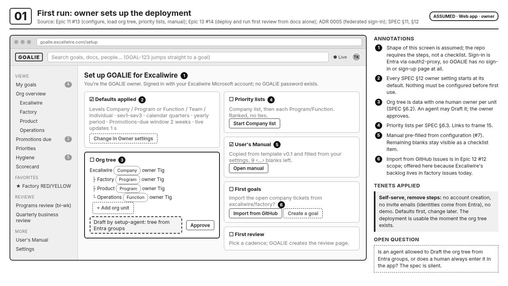

### 02 · Work between reviews: My goals (home)

My goals is home: RED first, a date type on every date, Drafts waiting, Presence, and live updates.

**Surface:** Web app · desktop · **Sources:** SPEC §1.2, §8.2 (standard views, default columns/sort); USERS_MANUAL App. A "Work between reviews"; Epic 7 #8

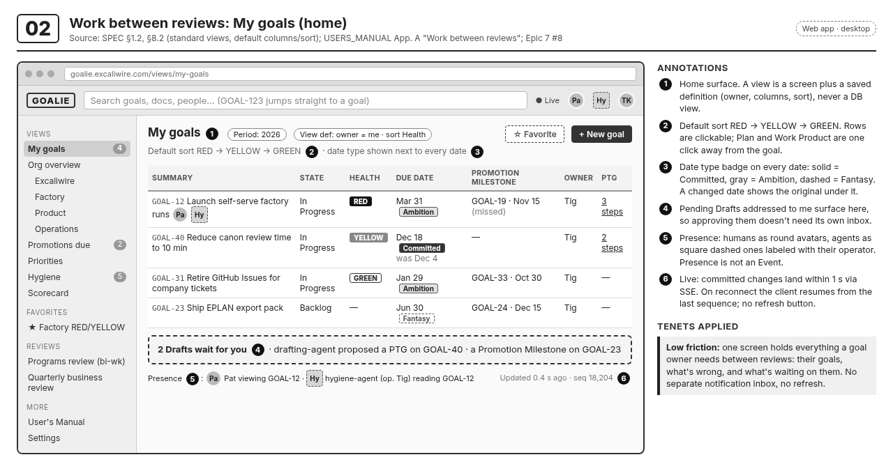

### 03 · Org overview and org-unit views

Org overview and per-unit views. Below-cut-line goals and goal-type mix are visible at a glance.

**Surface:** Web app · desktop · **Sources:** SPEC §8.2 (organization overview; one view per org unit), §6.2 (org tree as data), §6.3; Epic 7 #8

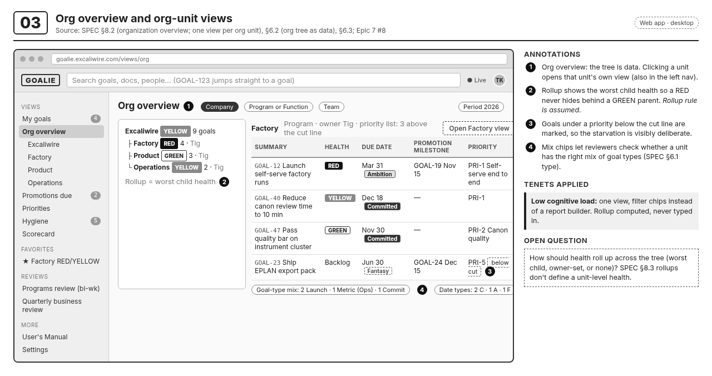

### 04 · Open a goal and read it

A goal page: every field, a live Draft banner, flat comments, and History and Work items tabs.

**Surface:** Web app · desktop · **Sources:** SPEC §1.2, §6.1 (fields), §6.6 (comments), §6.9 (Draft); USERS_MANUAL App. A "Work between reviews"; Epic 7 #8

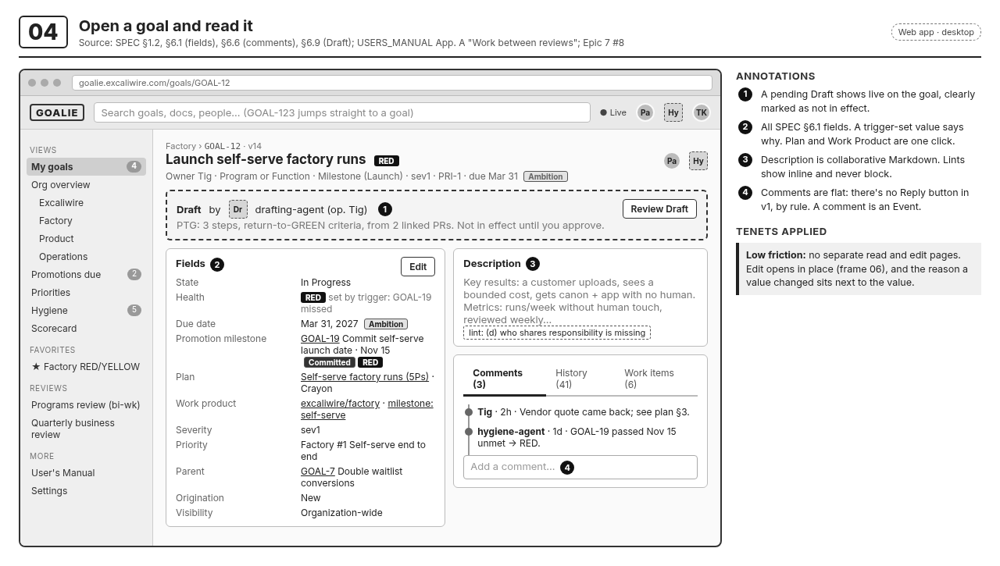

### 05 · Create a goal

Create a goal on one screen. An Ambition date expands its Promotion Milestone inline.

**Surface:** Web app · desktop · **Sources:** USERS_MANUAL App. A "Create a goal"; SPEC §5 promotion rule, §6.1; Epic 7 #8 ("goal editing shows the rules as you go"); Epic 8 #9 (draft Promotion Milestone)

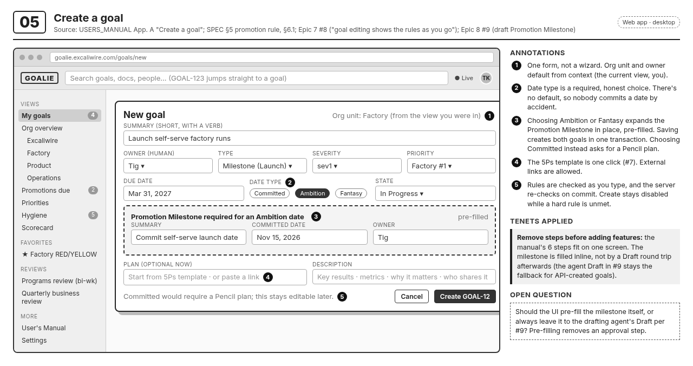

### 06 · Report trouble: set YELLOW and write the PTG

Set YELLOW and GOALIE asks for a structured Path to Green plus a reason before saving.

**Surface:** Web app · desktop · **Sources:** USERS_MANUAL App. A "Report trouble"; SPEC §6.1 health + path_to_green; rule 8; Epic 7 #8

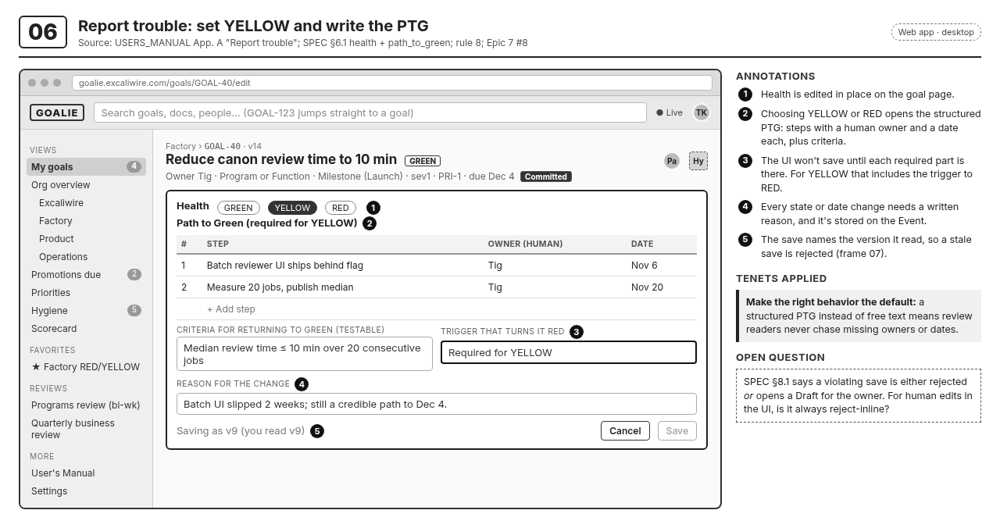

### 07 · Two people, one goal: stale write rejected

Two people, one goal. A stale structured save is rejected, current state shown, one-click re-apply.

**Surface:** Web app · desktop · **Sources:** SPEC §1.2 (two actors, one goal), §6 (versions; stale write rejected, current state returned), rule 10–11; ADR 0003, 0008

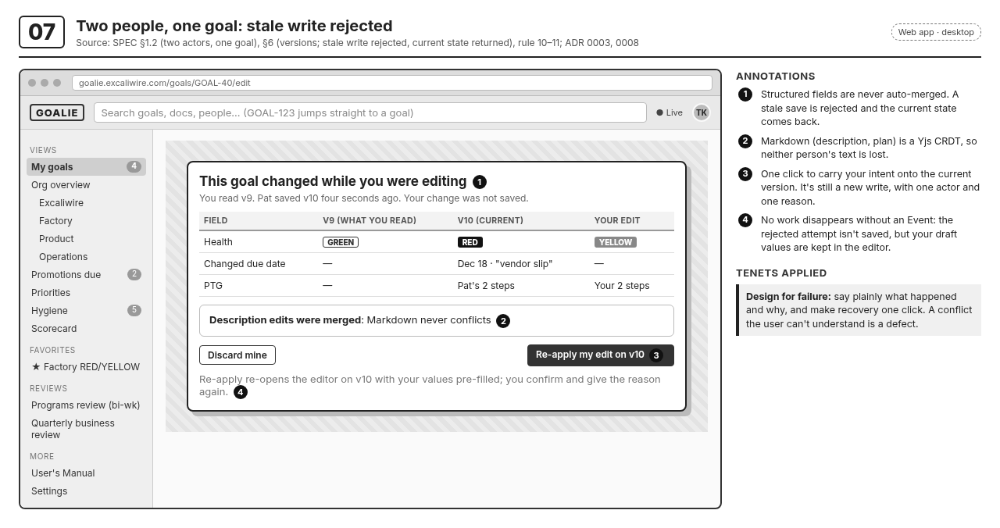

### 08 · Record a slip

Record a slip: the original committed date is locked, with a reason, health, and PTG in one write.

**Surface:** Web app · desktop · **Sources:** USERS_MANUAL App. A "Record a slip"; SPEC §5, §6.1 (original_committed_date, changed_due_date), rules 5–7

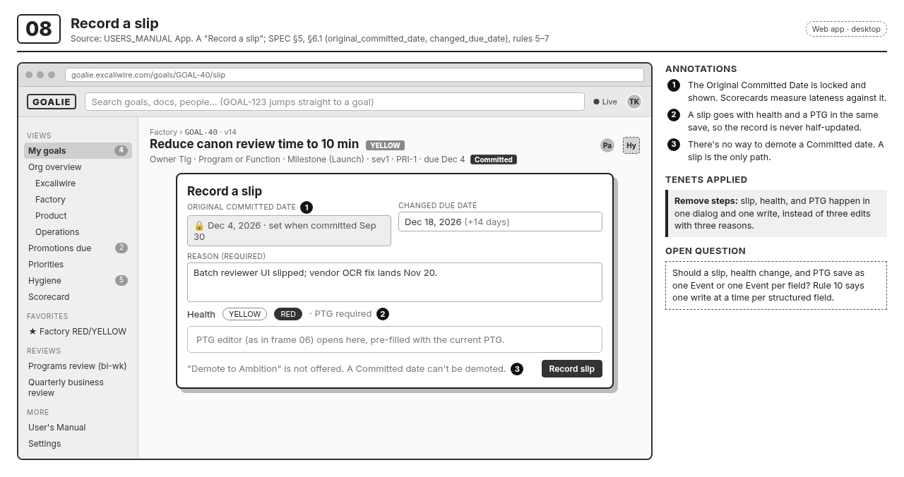

### 09 · Promote a date (commit)

Promote Ambition to Committed. The Pencil gate, the negotiated date, and the pinned plan version are all shown before you confirm.

**Surface:** Web app · desktop · **Sources:** USERS_MANUAL App. A "Promote a date"; SPEC §5, §6.1 (committed_plan_version), §7.1; Epic 6 #7 (pin on promote)

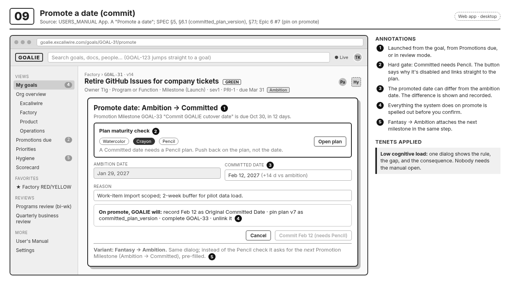

### 10 · Approve or reject an agent Draft

Approve or reject an agent Draft against its base version, with your reason on record.

**Surface:** Web app · desktop · **Sources:** USERS_MANUAL App. A "Approve or reject a Draft"; SPEC §6.9, §10, rule 12; Epic 8 #9

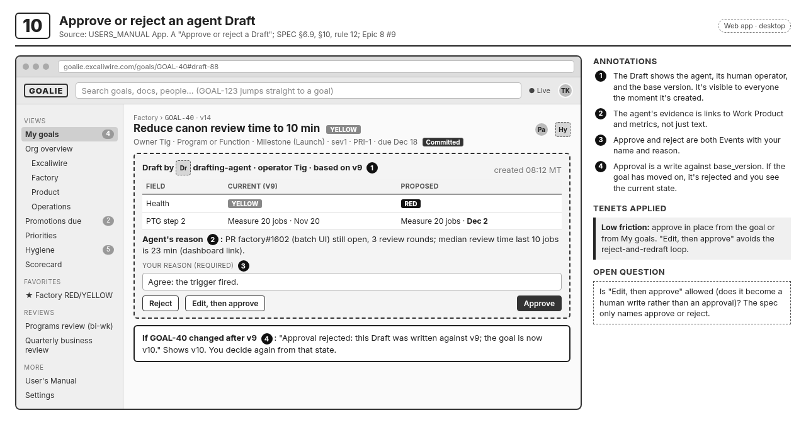

### 11 · Write the linked plan (collaborative Doc)

The plan is a live, collaborative Markdown Doc with versions and the commit-time pin.

**Surface:** Web app · desktop · **Sources:** SPEC §6.5 (Doc is a page; concurrent edit; versions), §1.2; Epic 6 #7; ADR 0008 (Yjs CRDT)

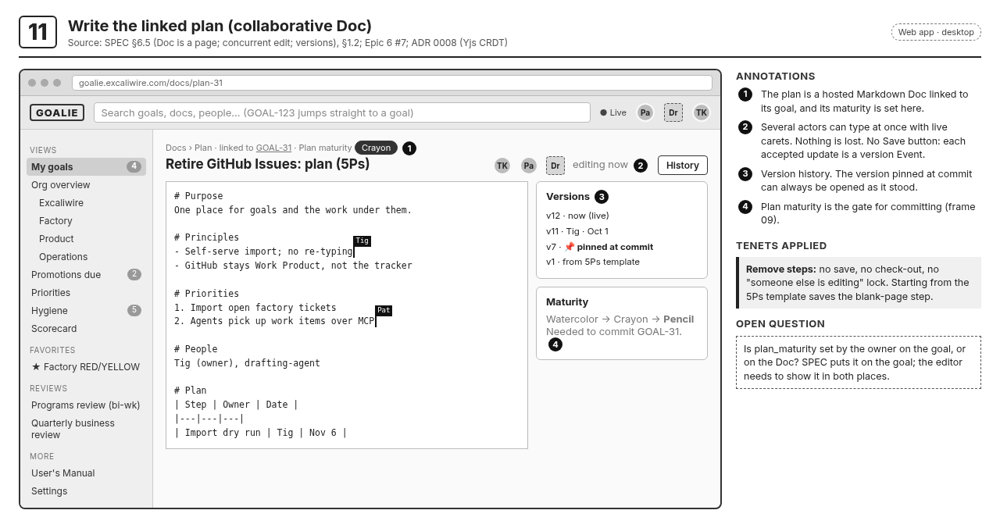

### 12 · Read a goal's history

Goal history: every Event with actor, old and new value, and reason, filterable across the period.

**Surface:** Web app · desktop · **Sources:** SPEC §6.6 (Events readable on the record; follow a goal across the period), §8.1 (status-theater flag); USERS_MANUAL App. A step 6; issue #31

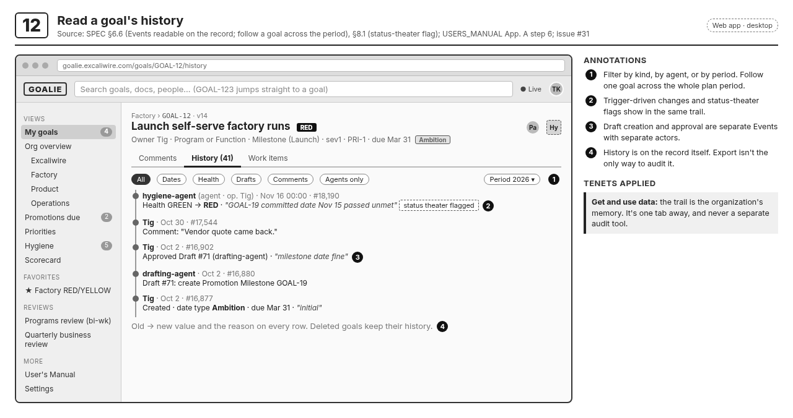

### 13 · Close a goal

Close a goal. On time or late is derived from the original committed date.

**Surface:** Web app · desktop · **Sources:** USERS_MANUAL App. A "Close a goal"; SPEC §7.2 (state lifecycle, closing rule), §8.1 (Deleted stays findable)

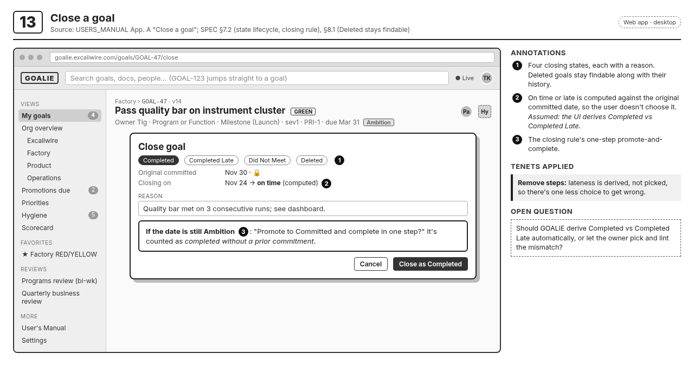

### 14 · Promotions due

Promotions due: milestones in the window, plus missed ones, each with its action on the row.

**Surface:** Web app · desktop · **Sources:** SPEC §8.2 (Promotions due, default 2 weeks), §5; USERS_MANUAL §6 step 5; Epic 8 #9 (reminders)

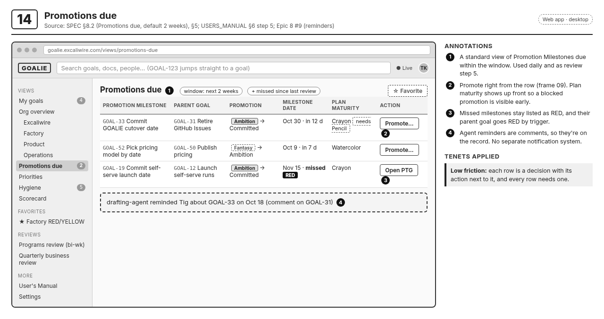

### 15 · Priorities: ranked list, cut line, re-rank

Priorities: a ranked list with what each entry starves, an explicit cut line, drag-to-re-rank with a reason, and starvation bars.

**Surface:** Web app · desktop · **Sources:** SPEC §6.3 (ranked, unique ranks, cut line, lints), §3.13, §8.3 starvation; USERS_MANUAL App. A "Re-rank priorities"; Epic 10 #11

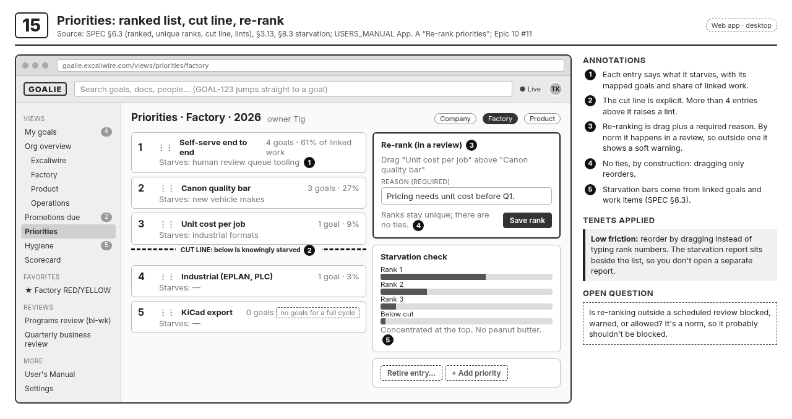

### 16 · Hygiene view

Hygiene: every invariant break and lint stays visible. Agents fix the safe ones.

**Surface:** Web app · desktop · **Sources:** SPEC §8.1 (invalid records stay visible; lints flagged not blocked), §8.3 hygiene; USERS_MANUAL §4; Epic 8 #9 (hygiene agent)

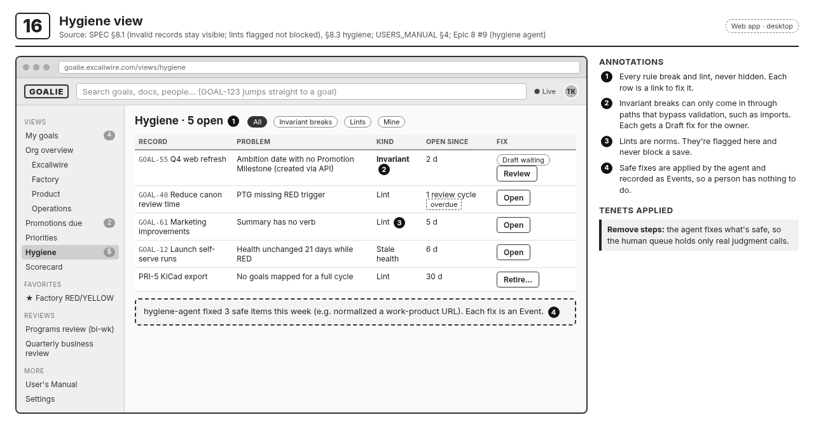

### 17 · Prepare a review: review page and agent pre-read

Review page plus an agent-drafted pre-read built from the event log.

**Surface:** Web app · desktop · **Sources:** Epic 10 #11 (review calendar, review pages, pre-reads); USERS_MANUAL §5, §7, App. B; SPEC §9, §10 (review prep)

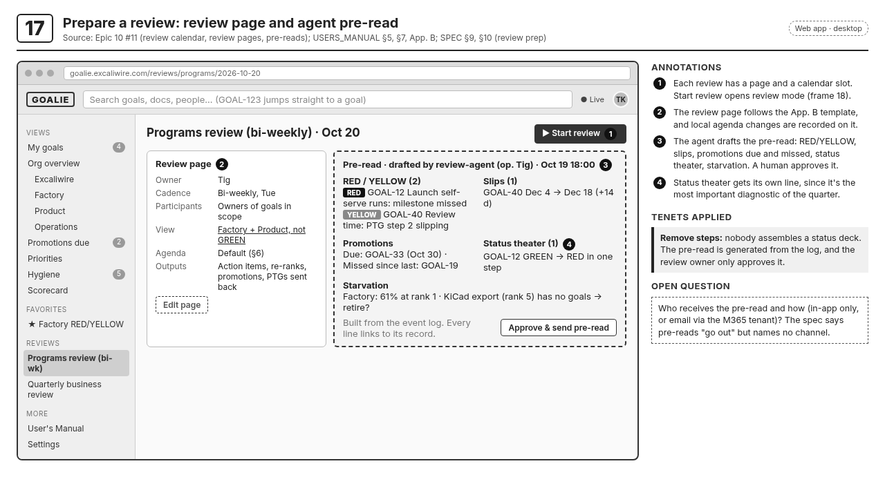

### 18 · Run the review: walk the view line by line

Review mode: walk RED and YELLOW line by line, decide in place, capture owned and dated action items.

**Surface:** Web app · desktop · **Sources:** Epic 10 #11 (review mode, decisions and action items as Events); USERS_MANUAL §6; SPEC §9; Epic 7 #8 done-when (run default review end to end in the app)

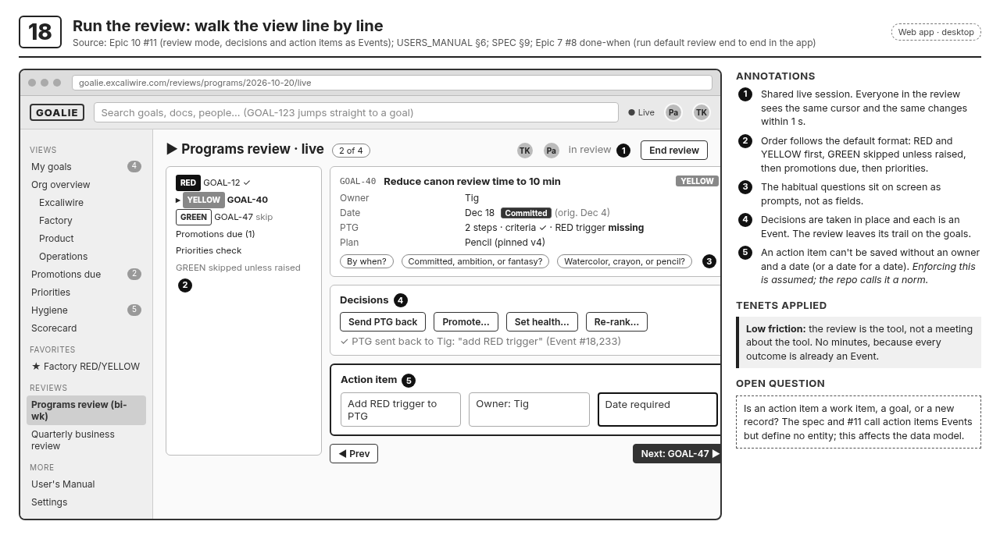

### 19 · Scorecard and GOALIE health (fitness functions)

Scorecard and GOALIE health: fitness functions against the manual's targets, plus full export.

**Surface:** Web app · desktop · **Sources:** Epic 9 #10 (rollups, scorecard, GOALIE health page); SPEC §8.3; USERS_MANUAL §7–8

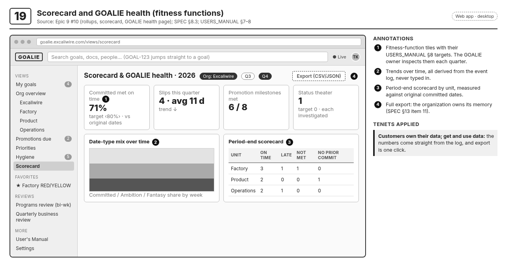

### 20 · Period reset

Period reset: close out every goal in one pass and re-create continuing work as Carryover or Repeating.

**Surface:** Web app · desktop · **Sources:** SPEC §7.3, §3.12; USERS_MANUAL App. A "Period reset", §5 (year end)

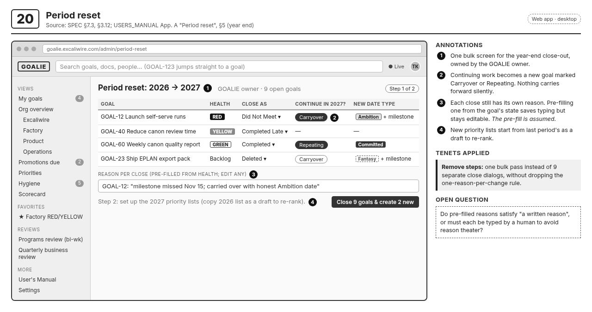

### 21 · Make a view: saved, shareable definition

Make a view: a saved, shareable definition of filters, columns, and sort, with a live preview.

**Surface:** Web app · desktop · **Sources:** SPEC §8.2 (view = screen + saved definition; filters), §13 items 7 & 28; Epic 7 #8 (saved, shareable views)

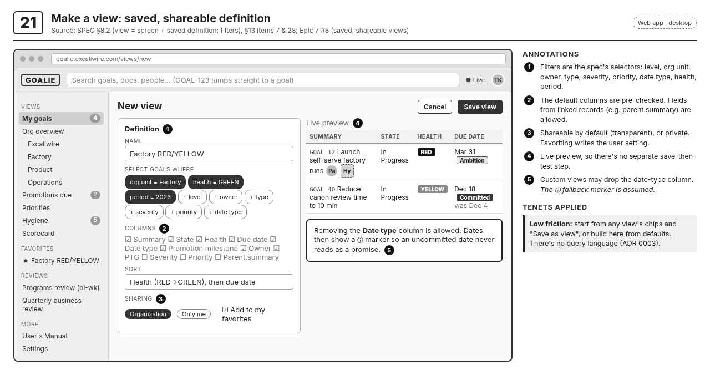

### 22 · File and track work items (optional extension)

Work items (optional): the list under a goal, quick-add, GitHub import, and evidence for health.

**Surface:** Web app · desktop · **Sources:** SPEC §6.7; Epic 12 #12 (work items, intake, GitHub import, evidence for health); USERS_MANUAL App. A step 5

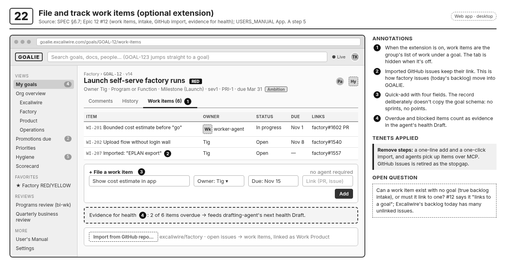

### 23 · Read and maintain the User's Manual

The User's Manual lives in GOALIE, is filled from config, and doubles as the agents' rulebook.

**Surface:** Web app · desktop · **Sources:** SPEC §11 (hosted, versioned, linked from views and goal creation; agents' instructions); Epic 6 #7 (filled from config; changelog drafted); USERS_MANUAL.md

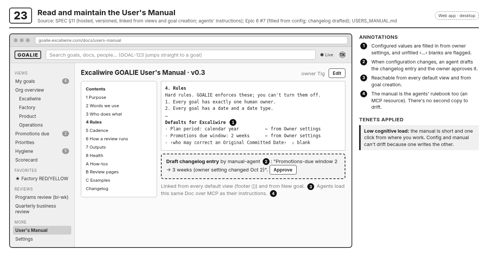

### 24 · Settings: my settings and owner settings

Settings: users change appearance and favorites; only the GOALIE owner sees owner settings.

**Surface:** Web app · desktop · **Sources:** SPEC §12 (owner vs user settings); ADR 0011; Epic 7 #8 (user settings); Epic 13 #14 (all settings without touching code)

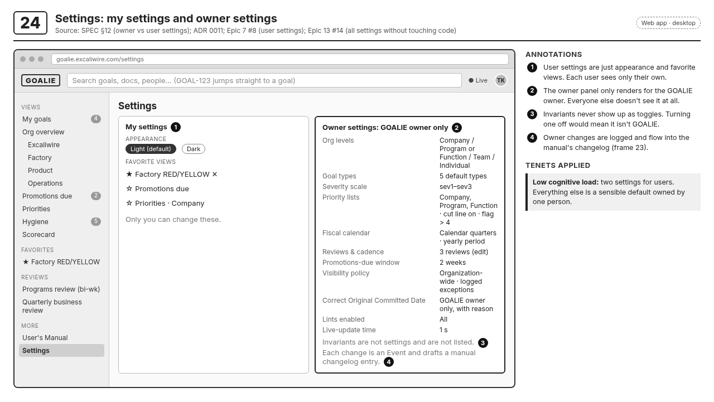

### 25 · Phone width: My goals, approve a Draft, comment

Phone width: the same web app for triage. Approve Drafts and comment from a phone browser.

**Surface:** Mobile web (phone browser) · **Sources:** ADR 0010 (one web app; same pages usable at phone width; no native app); SPEC §1 (web and mobile); Epic 7 #8 (accessible, phone-sized)

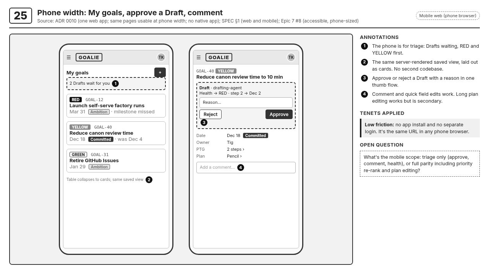

### 26 · Agent surface: an agent works GOALIE over MCP

Agent surface: an agent creates goals and Drafts over MCP, errors name the broken rule, and the Draft shows live in the app.

**Surface:** Agent · MCP (CLI/chat) · **Sources:** Epic 5 #6 (MCP tools for each App. A how-to; Drafts; comments; errors name the rule; manual as resource); ADR 0004, 0005, 0007; SPEC §1.1, §10, §13 items 8, 21–22

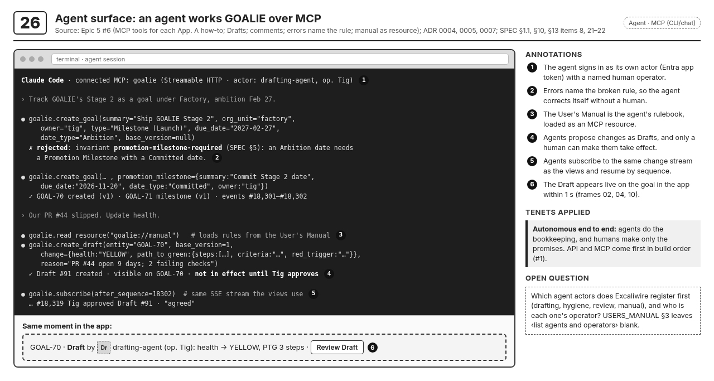

## Product tenets applied

These are the Excaliwire product development tenets, applied to GOALIE's first deployment.

- **Delight is low friction: remove steps before adding features.** Creating a goal takes one screen, with its Promotion Milestone filled in on the same form (05). A slip, its health, and its PTG save together (08). Period reset is one bulk pass (20). Plan Docs have no Save button (11). Drafts are approved where they appear (02, 04, 10).
- **Self-service.** GOALIE has no accounts, invites, or demo of its own. Identities come from the deployment's issuer ([0005](../adr/0005-auth-and-identity.md)). Every owner setting starts at its default (01). Agents keep the records over MCP (26).
- **Design for failure.** A stale write is rejected with the current state and a one-click re-apply (07). A client resumes the change stream from its last sequence ([0007](../adr/0007-live-update.md)). Errors name the rule that was broken (26).
- **Customers own their data.** Full export is one click (19). History is readable on every record (12).

## Assumptions

Each of these is marked *assumed* on its frame.

- **Assumed screen: first run (01).** The repo requires the setup steps: configuration, the org tree, the priority lists, the User's Manual, and the first goals ([#13](https://github.com/tig/goalie/issues/13), [#14](https://github.com/tig/goalie/issues/14)). It does not specify a checklist screen. Sign-in is federated through the deployment's gate ([0005](../adr/0005-auth-and-identity.md)), so GOALIE has no sign-in, sign-up, or password screen.
- **Assumed: health rollup on the org tree (03).** A unit shows its worst child's health.
- **Assumed: derived close state (13).** Completed vs. Completed Late is computed from the original committed date, not picked.
- **Assumed: action items need an owner and a date (18).** The repo calls this a norm. The frame enforces it.
- **Assumed: pre-filled reasons in period reset (20).** Each close still carries its own editable reason.
- **Assumed: a marker on dates when a custom view hides the date type column (21).**
- **Assumed: navigation.** The left nav's order, the favorites list, and the reviews section are a layout choice. The views themselves are the [SPEC.md §8.2](../../SPEC.md#s8-2) standard views.
- **Assumed: sample data.** Goal ids, org units (Factory, Product, Operations), a second human ("Pat"), and agent names are illustrative. [0005](../adr/0005-auth-and-identity.md) says the first deployment has one human actor.

## Open product questions

1. **01 First run: owner sets up the deployment:** Is an agent allowed to Draft the org tree from Entra groups, or does a human always enter it in the app? The spec is silent.
2. **03 Org overview and org-unit views:** How should health roll up across the tree (worst child, owner-set, or none)? SPEC §8.3 rollups don't define a unit-level health.
3. **05 Create a goal:** Should the UI pre-fill the milestone itself, or always leave it to the drafting agent's Draft per #9? Pre-filling removes an approval step.
4. **06 Report trouble: set YELLOW and write the PTG:** SPEC §8.1 says a violating save is either rejected or opens a Draft for the owner. For human edits in the UI, is it always reject-inline?
5. **08 Record a slip:** Should a slip, health change, and PTG save as one Event or one Event per field? Rule 10 says one write at a time per structured field.
6. **10 Approve or reject an agent Draft:** Is "Edit, then approve" allowed (does it become a human write rather than an approval)? The spec only names approve or reject.
7. **11 Write the linked plan (collaborative Doc):** Is plan_maturity set by the owner on the goal, or on the Doc? SPEC puts it on the goal; the editor needs to show it in both places.
8. **13 Close a goal:** Should GOALIE derive Completed vs Completed Late automatically, or let the owner pick and lint the mismatch?
9. **15 Priorities: ranked list, cut line, re-rank:** Is re-ranking outside a scheduled review blocked, warned, or allowed? It's a norm, so it probably shouldn't be blocked.
10. **17 Prepare a review: review page and agent pre-read:** Who receives the pre-read and how (in-app only, or email via the M365 tenant)? The spec says pre-reads "go out" but names no channel.
11. **18 Run the review: walk the view line by line:** Is an action item a work item, a goal, or a new record? The spec and #11 call action items Events but define no entity; this affects the data model.
12. **20 Period reset:** Do pre-filled reasons satisfy "a written reason", or must each be typed by a human to avoid reason theater?
13. **22 File and track work items (optional extension):** Can a work item exist with no goal (true backlog intake), or must it link to one? #12 says it "links to a goal"; Excaliwire's backlog today has many unlinked issues.
14. **25 Phone width: My goals, approve a Draft, comment:** What's the mobile scope: triage only (approve, comment, health), or full parity including priority re-rank and plan editing?
15. **26 Agent surface: an agent works GOALIE over MCP:** Which agent actors does Excaliwire register first (drafting, hygiene, review, manual), and who is each one's operator? USERS_MANUAL §3 leaves ‹list agents and operators› blank.

## Regenerate

The generator is [`wireframes/src/`](wireframes/src/). [`kit.py`](wireframes/src/kit.py) holds the shared styles and components. `frames1.py` through `frames7.py` each add frames in order. [`build.py`](wireframes/src/build.py) renders every frame to a PNG at 1280 px wide with headless Chromium, then writes the walkthrough.

```sh
pip install playwright
python -m playwright install chromium
python docs/specs/wireframes/src/build.py
```

Set `CHROME_PATH` to use an installed Chrome or Chromium instead of Playwright's bundled browser. The build replaces `wireframes/png/` and `wireframes/walkthrough.md`. Commit the regenerated PNGs and walkthrough in the same pull request as the source change.
